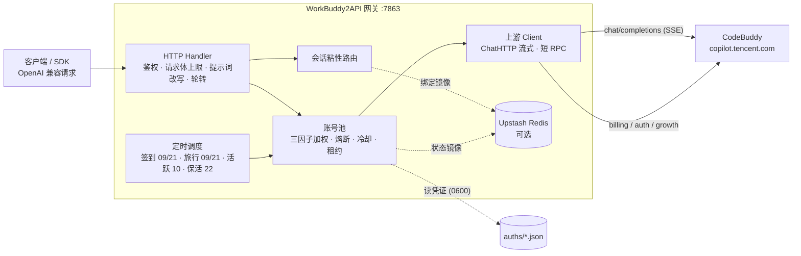

<p align="center">
  
</p>

<h1 align="center">WorkBuddy2API</h1>

<p align="center">
  <b>把腾讯 CodeBuddy 账号变成 OpenAI 兼容 API 的多账号网关</b><br>
  OAuth 登录 · 账号池轮转 · 熔断与冷却 · 会话粘性 · 定时签到 / 活跃 / 旅行 / 保活 · 流式 / 非流式
</p>

<p align="center">
  
  
  
  
  <a href="https://t.me/sliverkiss_blog"></a>
</p>

---

## 项目简介

WorkBuddy2API 是一个自托管的 **OpenAI 兼容反向代理网关**，将腾讯 CodeBuddy（`copilot.tencent.com`）账号包装为 `/v1/chat/completions`、`/v1/responses` 和 Anthropic 兼容的 `/v1/messages` 服务。

- 官方不提供 OpenAI 形态的开放 API，本项目通过 **OAuth 设备授权**（`login.sh`）获取账号凭证，在网关侧做 token 自动刷新、账号池调度与流量治理；
- 面向 **个人多账号** 场景：多账号共享、单号故障自动换号、冷却 / 熔断防止雪崩、会话粘性保证多轮上下文不跳号；
- 对客户端只暴露 OpenAI 兼容接口，现有 SDK / 前端 / 工具 **零改造接入**；
- 同时支持两条互相隔离的上游产品线（**realm**）：CodeBuddy CN（`copilot.tencent.com`）与
  WorkBuddy AI（`www.workbuddy.ai`，即 WorkBuddy 桌面端那条线），按账号与 key 分区调度，
  详见下文「产品线（realm）：cn / workbuddy / codebuddy」。

> ⚠️ 合规须知：本项目是**非官方**网关，使用 CodeBuddy 账号作为上游，**仅限本人授权账号、本机 / 私有环境测试**。详细边界见[安全与合规](#安全与合规)。

## 核心能力

| 能力 | 说明 |
|---|---|
| 🖥️ **控制台（/admin）** | 内嵌单页（无构建依赖）：浏览器里触发登录授权（自动轮询 + 落盘 + 热加载账号池）、查看凭证数量与逐个账号的积分/健康/冷却/熔断/成功率；使用账号密码登录，并提供分发 Key 管理。列表**实时更新**（SSE 推送**带状态负载**，状态变化 ~200ms 到达后前端直接应用，**无兜底轮询**；断线重连时补一次全量），每行可**单独刷新该号额度**（真实上游查询），另有每 10 分钟的全量余额刷新 |
| 🌐 **双产品线（realm）** | 账号凭证自带 `realm`（cn / workbuddy，外加路线别名 codebuddy），池、调度、上游 base 与出站指纹按 realm 分派，**不跨池回退**；桌面端已登录凭证可一键导入（`cmd/importauth`） |
| 🔑 **OAuth 一键登录** | `login.sh` 设备授权流程，自动落盘凭证并重启容器加载新账号 |
| 🔄 **多账号池** | 三因子加权随机选号（积分占比 ×10 + 闲置补偿 + 成功率 ×3），Top-5 候选 + 防惊群 |
| 🛡️ **熔断与冷却** | 429 软冷却 600s 起指数退避（封顶 `soft_rate_max`）、404 固定 60s 短冷却、402 硬冷却至次日 04:00、连续失败熔断、在途租约限流 |
| 🧲 **会话粘性** | 同一会话（`conversation_id`）尽量绑定同一账号，TTL 滚动续期，失败自动解绑，可镜像 Redis 防重启丢失 |
| ⏰ **定时任务** | 签到（09/21 点）+ 活跃上报（10 点，点亮连登 / 解锁领养 + streak 自检）+ 猫猫旅行（09/21 点，独立排程）+ token 保活（22 点），四类独立开关 |
| ⚡ **流式 + 非流式** | 出站强制 `stream:true`；SSE 帧按规范白名单重建；非流式由本地聚合为单响应 |
| 🧠 **推理模型兼容** | DeepSeek 思维链注入（`thinking.type=enabled` + 默认档）、`reasoning_content` 多轮回填、effort 档位自动降级 |
| 💬 **系统提示词** | 网关**不内置任何提示词**：默认 `passthrough` 原样透传客户端 body；配了 `prompt.file` 才替换（`custom`）；内容拦截降级只**剥离** system，不注入文案 |
| 🗑️ **指纹脱敏** | 出站请求体黑名单指纹字段清洗（可关闭），与提示词体系两层叠加 |
| 📊 **可观测** | 每请求一行表格日志（TTFB / token 速率 / uid）；`/healthz` 带 `service` 身份标识可接负载均衡 / 宿主探活 |
| 💾 **状态持久化** | 池状态本地原子落盘 + Upstash Redis 异步镜像（可选），重启择新恢复 |

## 架构总览



上游请求在出站前经历统一的改写管线（`internal/upstream/payload.go`）：强制 `stream:true`、`developer` 角色归一、tool_choice 归一、DeepSeek 思维链注入、`reasoning_effort` 档位降级、`reasoning_content` 回填、指纹脱敏。

## 快速开始

### 环境要求

- **Docker + Docker Compose**（推荐部署方式，镜像内已含 `app` 低权限用户与全部工具脚本）
- 一个或多个已注册的 CodeBuddy 账号，用于 OAuth 登录
- 宿主机 Go ≥ 1.22（仅源码构建时需要）

### Docker Compose 一键部署

```bash
git clone https://github.com/Sliverkiss/workbuddy2api.git
cd workbuddy2api
cp config.example.json config.json
```

复制配置后启动服务，在 `/admin` 设置管理员账号密码，再进入「访问密钥」创建客户端 Key。首次初始化需要本机 `data/access.json.setup-token` 中的一次性凭据；完整路径见启动日志。新安装没有默认密码，也不会在未配置 Key 时放行 API。

```bash
# 登录添加账号（重复执行可加多号）
./login.sh

# 启动服务
docker compose up -d --build

# 健康检查（无可用账号时 503）；service 字段用于确认打到的是本网关
curl -s http://localhost:7863/healthz
# {"healthy":2,"total":3,"service":"workbuddy2api"}
```

`login.sh` 内置授权 URL 获取 + 浏览器登录 + token 轮询 + 首次签到 + `auths/workbuddy-<uid>.json` 落盘 + 容器重启，全程无 PKCE（state 由服务端签发）。账号池在容器启动时用 `auths/` 目录自动对齐，新增凭证文件即自动发现。

### 容器内登录与凭证导入

不想在宿主机装 Go 时，直接用镜像里的二进制：

> **Git Bash 提示**：`docker compose exec` 后面的容器内路径（如 `/app/login`）会被 MSYS
> 转换成本地路径，加 `MSYS_NO_PATHCONV=1` 前缀即可避免。

```bash
# 1) 取 OAuth 授权链接（workbuddy 线；去掉 -realm 即 cn 线）
docker compose exec -T wb2api /app/login url -realm workbuddy
#    → 浏览器打开输出的链接完成登录

# 2) 拉取 token（写入容器内 state → 用 login.sh 落盘更省事，见下）
docker compose exec -T wb2api /app/login poll -realm workbuddy

# 3) 复用桌面端已登录凭证（需在 compose 里把桌面端凭证目录只读挂成 /desktop-auth）
docker compose exec -T wb2api /app/importauth -source /desktop-auth/workbuddy-desktop-ai.info -out /app/auths

# 4) 批量签到 / 积分日报（realm 由 auth 文件自带）
docker compose exec -T wb2api /app/signin_bin /app/auths
docker compose exec -T wb2api /app/credit /app/auths
```

宿主机侧仍推荐 `./login.sh workbuddy`（旧名 `ai` 等价）：脚本会自己重启容器加载新账号。

**受限网络构建**（Docker Hub / Go module proxy 不通时，走本地代理）：

```bash
BUILD_PROXY=http://host.docker.internal:7890 docker compose build
# 或只换 Go module 源：BUILD_GOPROXY=https://goproxy.cn,direct docker compose build
```

容器内访问上游（`www.workbuddy.ai` / `*.tencent.com`）国内可直连；若你的出口需要代理，
在 compose 的 `environment` 里加 `HTTPS_PROXY=http://host.docker.internal:7890`（同样注意
容器内的 `127.0.0.1` 不是宿主机）。

### 源码构建

```bash
go build ./...
go vet ./...
go test ./...      # 完整测试套件
go run ./cmd/server -config config.json
```

构建二进制：

```bash
CGO_ENABLED=0 go build -trimpath -ldflags="-s -w" -o wb2api ./cmd/server
CGO_ENABLED=0 go build -trimpath -ldflags="-s -w" -o signin_bin ./cmd/signin
CGO_ENABLED=0 go build -trimpath -ldflags="-s -w" -o login ./cmd/login
CGO_ENABLED=0 go build -trimpath -ldflags="-s -w" -o credit ./cmd/credit
```

### 验证

```bash
# 模型列表
curl -s http://localhost:7863/v1/models -H "Authorization: Bearer your-api-key"

# 账号状态（汇总 + 每账号详情，disabled 账号透出 disabled_reason）
curl -s http://localhost:7863/status -H "Authorization: Bearer your-api-key"

# 流式聊天
curl -sN http://localhost:7863/v1/chat/completions \
  -H "Authorization: Bearer your-api-key" \
  -H "Content-Type: application/json" \
  -d '{"model":"deepseek-v4-flash","messages":[{"role":"user","content":"hi"}],"stream":true}'

# 非流式聊天（本地聚合）
curl -s http://localhost:7863/v1/chat/completions \
  -H "Authorization: Bearer your-api-key" \
  -H "Content-Type: application/json" \
  -d '{"model":"deepseek-v4-flash","messages":[{"role":"user","content":"hi"}],"stream":false}'
```

## 产品线（realm）：cn / workbuddy / codebuddy

网关支持两条**互相隔离**的产品线（`cn` ↔ `workbuddy` 的 token 不互通，跨线一律 401），
外加一条**路线别名** `codebuddy`（CodeBuddy IDE 域）：

| realm | 产品 | chat base | billing / 签到 base | OAuth platform | 凭证来源 |
|---|---|---|---|---|---|
| `cn`（默认） | CodeBuddy CN | `https://copilot.tencent.com` | `https://www.codebuddy.cn` | `CLI` | 自身 |
| `workbuddy` | WorkBuddy AI（桌面端同款） | `https://www.workbuddy.ai` | `https://www.workbuddy.ai` | `workbuddy-ai` | 自身（历史名 `ai` 等价） |
| `codebuddy` | CodeBuddy IDE 域 | `https://www.codebuddy.ai` | `https://www.codebuddy.ai` | `workbuddy-ai` | **`workbuddy`（路线别名）** |

`codebuddy` 与 `workbuddy` 是**同一后端、同一账号空间、同一份账单**（`/v3/config` 的 data 段逐字段一致、
billing 返回同一钱包），所以它不是新栽一棵树，而是一根**指向 workbuddy 账号池的分机**：
账号 / 额度 / 冷却 / 在途状态全部共享，只把出站 base、Origin/Referer 与归因换成 codebuddy 域。
### 接入方式一：复用桌面端已登录账号（推荐）

本机装了 **WorkBuddy AI 桌面端**并登录过时，凭证是明文 JSON，落在
`%LOCALAPPDATA%\CodeBuddyExtension\Data\Public\auth\workbuddy-desktop-ai.info`：

```bash
go run ./cmd/importauth            # 自动探测 → 校验余额 → 写 auths/workbuddy-ai-<uid>.json
go run ./cmd/importauth -list      # 只列出凭证文件里的账号（多账号时看 uid）
go run ./cmd/importauth -dry-run   # 只打印将要写入的内容，不落盘
```

导入会把桌面端的**毫秒** `expiresAt` 归一为 Unix 秒，并调一次余额接口确认该 token 对这条线有效；
之后网关自己负责 token 刷新（refresh 成功后原子写回同一文件）。

### 接入方式二：网关侧 OAuth 设备流

```bash
./login.sh workbuddy    # WorkBuddy AI 线（authUrl 指向 www.workbuddy.ai/login?platform=workbuddy-ai；旧名 ai 等价）
./login.sh       # cn 线（默认，行为与改造前一致）
```

### 请求分流：按 key 分区，不猜模型

```json
{
  "security": { "store_file": "./data/access.json" },
  "upstream": { "realm": "cn" },
  "realms": { "workbuddy": {} }
}
```

- 在「访问密钥」分别创建允许 `cn`、`workbuddy` 的 Key，并设置各自的默认渠道。模型前缀和 `X-Realm` 可以选择渠道，但必须在该 Key 的白名单中（旧名 `ai` 等价于 `workbuddy`）。
- **不跨池回退**：主干线（cn / workbuddy）的账号/额度互不相通，跨线只会拿到 401/400，宁可返回 503 也不串号
- 各主干线状态分开持久化（`data/state.json` 与 `data/state-workbuddy.json`；旧的 `state-ai.json` 首次启动自动迁移），积分/冷却/熔断互不干扰；**路线别名（codebuddy）不另建状态**，与来源线共享同一份
- `/admin/api/overview` 提供管理端账号汇总和渠道信息；`/status` 仅返回服务标识和当前 Key 可访问的渠道；`/healthz` 任一池可服务即 200。

### 渠道前缀：模型名即渠道（`workbuddy/<模型>` · `codebuddy/<模型>`）

模型名前面带上渠道前缀，网关据此选线，**上游只看到裸模型名**（前缀在出站前剥离）：

| 你发的 model | 走的线 | 上游收到 |
|---|---|---|
| `workbuddy/deepseek-v4.1-flash` | `workbuddy`（www.workbuddy.ai） | `deepseek-v4.1-flash` |
| `codebuddy/deepseek-v4.1-flash` | `codebuddy`（www.codebuddy.ai） | `deepseek-v4.1-flash` |
| `deepseek-v4.1-flash`（无前缀） | 按 key / `X-Realm` / 默认线（既有行为） | 原样 |

- **用途**：同一条国际线有两个域，用前缀把"调用渠道"写进模型名 —— 客户端、日志、账单一眼可辨，不必依赖额外的请求头
- **大小写不敏感**；**未知前缀不剥离**（整串透传），避免误伤本身含 `/` 的模型 id；`codebuddy/`（裸名为空）按无前缀处理
- **前缀是可选的装饰**：不带前缀的调用完全不受影响
- **越权保护**：`X-Realm` 和模型前缀指定的渠道均需在 Key 白名单中；否则返回 403。即使 `workbuddy` 和 `codebuddy` 共用账号池，也需要分别授权。不会静默改走其他渠道。
- **`/v1/models`** 仅列出当前 Key 获准且已启用渠道的模型；返回的 id 带渠道前缀，同时包含 `channel` 与 `base_id`。
- **自定义映射**（可选）：

```json
"model_prefixes": { "workbuddy": "workbuddy", "codebuddy": "codebuddy", "wb": "workbuddy" }
```

  不写就用内置 `{workbuddy: workbuddy, codebuddy: codebuddy}`；非法条目（空前缀、含 `/`、未知 realm）启动即报错。

### codebuddy 路线（与 workbuddy 共用账号池）

```json
{
  "realms": {
    "workbuddy": {},
    "codebuddy": { "auth_realm": "workbuddy" }
  }
}
```

- **启用方式**：`realms.codebuddy`（或 `upstream.realm_overrides.codebuddy`）出现即启用（仓库自带的 `config.json` / `config.example.json` 已配好）；不配则与改造前逐字一致（不多暴露路由、不多注册 key）
- **调用方式**：创建允许 `codebuddy` 的 Key；将其默认渠道设为 `codebuddy`，或使用 `X-Realm: codebuddy` / 模型 `codebuddy/` 前缀。
- **复用而不是复制**：`codebuddy` 与 `workbuddy` **共用同一个池对象**——账号、积分、冷却、在途、禁用状态一份，不存在"两套额度记账"；管理端总览的多池明细只列主干线，别名线挂在 `routes` 字段（`{"codebuddy":"workbuddy"}`），顶层聚合按池指针去重，不会把同一批账号算两次
- **凭证仍按来源线归档**：在控制台选 codebuddy 路线登录，落盘依旧是 `auths/workbuddy-ai-<uid>.json`（历史命名）、`realm=workbuddy`（token 本就属于国际线，两个域通用）
- **不单独起调度器**：签到 / 旅行 / 活跃 / 保活只在来源线跑一遍，不会对同一账号重复执行
- **来源线限制**：`cn` 不能作为 `auth_realm` 的来源线（跨线 token 必 401），配置层直接报错

### 额度：codebuddy 与 workbuddy 共用吗

**共用**。同一凭证在两个域查到的就是同一份资源与消耗（实测同账号同响应）：

- **上游账单（权威）**：`POST {billing_base}/v2/billing/meter/get-user-resource`，`www.workbuddy.ai` 或 `www.codebuddy.ai` 均可，同一个 `Bearer` 返回同一份数据；`data.Response.Data` 里是 `TotalCount` / `TotalDosage` 与 `Accounts[]`（每个套餐一条：`CapacityRemain` / `CapacityUsed` / `CapacitySize`、`CycleCapacity*` 为本周期口径、`SubProductName` 标出产品，例如 `Tencent Cloud CodeBuddy（IDE）`）
- **网关侧**：`auths/` 凭证 + `data/state*.json`（池状态）+ 使用日志（每请求一条，含"调用前/后余额差"）；控制台「凭证一览」的积分列与「刷新额度」按钮走的就是上面那个上游接口
- 结论：**不存在"走 codebuddy 域能多领一份额度"**，两条路线花的是同一个钱包；`codebuddy` 的价值在客户端/域兼容与归因，不在额度

### 两条线的协议差异（实测）

| 差异 | 上游表现 | 网关处理 |
|---|---|---|
| 拒绝非流式 | `code 11101 Non-stream chat request is currently not supported` | 出站本就强制 `stream:true`；客户端 `stream:false` 由本地聚合 |
| 首条消息必须是 system | `code 11128 first message is not system prompt` | 出站前补一条**空 system**（`content` 为空串，不注入任何提示词）；实测 2026-09-30：`content:""` 上游照样 200，缺 system / system 不在首位才 400 |
| 模型列表来源 | 国际线（workbuddy / codebuddy）走 `GET {chatBase}/v3/config`（服务端产品配置）；cn 线走 `/console/enterprises/personal/models` | 网关按 realm 分派动态拉取（见下节「模型列表：以服务端下发为准」）；控制台接口在 workbuddy 线不适用（500/403） |
| 连登查询 500 | `/v2/activity/growth/streak` → 500 | 只影响 streak 自检（warn 一行），不影响活跃上报主流程 |
| 运营功能对齐度 | 签到 / 宠物 / 活跃上报路径均存在 | 默认全开；若某路径返回 404（不存在），scheduler 自动标记 unsupported 并在本进程内跳过（仅对非 cn 线生效，也可用 `schedule.realm_tasks` 显式关闭） |

### 模型列表：以服务端下发为准

`/v1/models` 的名单直接来自上游服务端下发（并按渠道**聚合**，见下），网关**不维护手工模型表**：
**聚合口径**：一次 `/v1/models` 返回当前 Key 的渠道白名单与实例已启用渠道的交集。权限在管理页修改后，对新请求立即生效。

| realm | 来源 | 缓存 |
|---|---|---|
| `cn` | `GET {chatBase}/console/enterprises/personal/models`（控制台接口，返回 models + cli agent 名单） | 1h |
| `workbuddy` / `codebuddy` | `GET {chatBase}/v3/config`（服务端产品配置，与桌面端 UI 同源；两个域返回同一份） | 10min |

- 拉取失败：**沿用上一次成功下发的名单**（并进 5min 负缓存），不退回手工静态表
- 只有"从未成功拉到过"（冷启动 + 上游不可达）才走冷启动兜底：cn 保留一份快照，国际线返回空列表 —— 手写旧 id 已与服务端漂移（例如 `gemini-3.1-flash-lite`、`gpt-5.3-codex` 现在请求会直接 `11102 model not found`），返回空列表比返回假模型更诚实
- 服务端按**出站指纹**返回不同版本的配置，所以"看到的列表"与"出站身份"绑定：桌面指纹（`workbuddy-desktop`）拿到桌面端 UI 那份，cli 指纹拿到 CLI 口径（2026-10 实测：桌面口径 22 个模型、cli agent 21 个 id，含 `deepseek-v4.1-flash` / `hy3` 等免费档）：

```json
"upstream": { "realm_overrides": { "workbuddy": { "fingerprint": "workbuddy-desktop", "client_version": "5.5.2" } } }
```

> 注：网关对 `model` 字段是**透传**的 —— 列表只影响客户端选择器里能看到什么；任何不在列表里的 id（含 `enhance-1.0` / `nes-1.2` 这类内部别名）直接填名字请求，网关照样发给上游。
> 实测提醒：`gpt-5.6-*` 家族要求 `max_tokens ≥ 16`，更小会被上游 provider 以 `11133 model_param_invalid` 打回。

### 出站指纹（可切换）

上游按出站 UA / `X-Product` 做「使用端」归因。默认两条线都用官方 CLI 指纹（与改造前逐字一致）；
需要让 workbuddy 线被识别为 **WorkBuddy 桌面客户端**时：

```json
"upstream": {
  "realm_overrides": {
    "workbuddy": { "fingerprint": "workbuddy-desktop", "client_version": "5.5.2" }
  }
}
```

切换后该线出站变为 `User-Agent: WorkBuddy/<version>` + `X-Product: WorkBuddy`
+ `X-IDE-Type/X-IDE-Name: WorkBuddy` + `X-IDE-Version: <version>`，与桌面端 `AuthService` 的出站头一致。

## 额度冻结（余额为 0 的账号不再空转）

上游的"额度耗尽"是 **HTTP 429 + `Credits exhausted` + code 14018**（不是 402），
只看状态码会被误判成限流——那样账号每 10 分钟（软冷却到期）就重试一次、次次 429，
既白刷上游，又把成功率权重拖低。本项目对此做了两层处理：

1. **识别**：`code 14018` / `Credits exhausted`（含复数）一律判为 `hard_credit`；
2. **冻结**：判为额度耗尽后**冻结**账号 —— 与"冷却"不同，冻结是**条件解冻**：
   必须额度巡检确认余额恢复才解冻（签到/套餐周期刷新后自动恢复）。

```
余额耗尽 ──(请求撞上 or 巡检发现)──▶ 冻结（移出轮转）
                                        │
                          (每 30 分钟巡检余额)
                                        ▼
                              余额 > 0 ──▶ 自动解冻
```

### 额度巡检

| 配置 | 默认 | 说明 |
|---|---|---|
| `schedule.credit_watch_enabled` | `true` | 巡检总开关（关掉则冻结只能由请求撞额度耗尽触发，且恢复要等 `credit_freeze_max` 兜底） |
| `schedule.credit_watch_interval` | `30m` | 巡检间隔 |
| `schedule.credit_watch_scope` | `frozen` | `frozen` = 只查冻结中的账号（开销随冻结数变化）；`all` = 每轮查全部账号（能主动发现余额为 0 的号） |
| `schedule.credit_freeze_max` | `72h` | 冻结兜底：超过该时长即使没探测到恢复也放行一次，防止巡检被关闭时账号被永久冻结 |

**无论哪种范围，进程启动时都会全量巡检一次** —— 开局就把余额为 0 的号冻结，
不必等第一个请求撞上去。

观察方式：`/admin/api/overview` 与控制台（`/admin`）都有 `frozen` / `frozen_reason` 字段，
控制台的"额度冻结"卡片与状态筛选可直接用。

> 补充：`ReenableIfCredits`（签到/余额查询路径）也会参与判定 —— 余额为 0 时同样冻结，
> 余额恢复时解冻，与额度巡检共用同一套状态机。

## 管理登录与访问密钥

管理页采用单管理员账号密码登录；客户端采用独立分发 Key。两种凭据不互通。

1. 启动新版本后打开 `/admin`。首次使用时输入自选账号、8–72 字节密码，以及服务器 `data/access.json.setup-token` 文件中的一次性初始化凭据（自定义存储路径时以启动日志为准）。初始化后该文件删除、凭据失效。
2. 登录后打开「访问密钥」，点击「创建密钥」，设置名称、允许渠道、默认渠道、有效期、每分钟请求上限（0 表示不限）及启用状态。完整 Key 只返回一次，关闭弹窗后不能再次读取。
3. 客户端填写生成的 `sk-wb2a-...` Key。`/v1/messages` 同时支持 `x-api-key`，其他接口使用 `Authorization: Bearer <key>`。白名单分别控制 `cn`、`workbuddy`、`codebuddy`。
4. 可编辑权限或临时停用；「吊销」永久作废该 Key。新请求立即生效，已经开始的请求可完成。每分钟请求上限按自然分钟统计所有通过密钥认证的 API 请求（含模型列表及最终失败的请求），计数在重启后清零，不是积分预算。

密码使用 bcrypt 哈希；高熵 Key 使用 SHA-256 哈希，管理列表不返回哈希或完整 Key。管理会话在内存中保存 12 小时，浏览器使用 HttpOnly / SameSite=Strict Cookie，写操作校验 CSRF Token。登录按直连 IP 限制为每 5 分钟最多 10 次尝试；经过反代时共用反代 IP 的限制。认证数据原子写入，损坏时启动失败，避免静默重置权限；多实例不可共用同一文件。

**升级旧配置**：首次创建 `access.json` 时，旧 `api_key` / `realms.*.api_key` 自动导入为「迁移」Key。旧全局 Key 获得全部已知渠道；旧产品线 Key 保留同源渠道的调用范围，但不再拥有管理权限。之后配置中的旧 Key 被忽略，吊销不会因重启而恢复，可在确认迁移后移除旧配置字段。必须保留认证文件，删除它意味着重新初始化并可能重新导入旧 Key。

**无人值守初始化**：首次启动前设置 `WB2A_ADMIN_USERNAME` 和 `WB2A_ADMIN_PASSWORD`，启动时创建管理员；已有账号时这些变量不会覆盖密码，初始化后可移除。不要把管理员密码写入普通 JSON 配置。

**忘记密码**：先停止使用该认证文件的网关进程，在本机设置上述两个环境变量，再运行 `server -config config.json -reset-admin`（源码可用 `go run ./cmd/server -config config.json -reset-admin`）；完成后移除密码变量并正常启动。只重置管理员，不删除或恢复分发 Key。

| 管理接口 | 用途 |
|---|---|
| `GET /admin/api/auth/session` | 初始化/登录状态；已登录时返回 CSRF Token |
| `POST /admin/api/auth/setup` | 一次性初始化：username、password、setup_token |
| `POST /admin/api/auth/login` | username、password 登录并设置会话 Cookie |
| `POST /admin/api/auth/logout` | 退出当前会话 |
| `POST /admin/api/auth/password` | current_password、new_password 修改密码并使全部会话失效 |
| `GET /admin/api/keys` | 列出 Key、可配置渠道与已启用渠道 |
| `POST /admin/api/keys` | 创建 Key；完整 token 仅本次响应返回 |
| `PATCH /admin/api/keys/{id}` | 提交完整配置：name、channels、default_channel、expires_at（RFC3339 或 null）、rpm、enabled |
| `DELETE /admin/api/keys/{id}` | 永久吊销 |

除会话状态、初始化、登录外，管理接口必须携带登录 Cookie；写操作额外携带 `X-CSRF-Token`。分发 Key 访问管理 API 返回 401，未授权渠道返回 403，Key 过期/停用/吊销返回 401，超出频率返回 429。

## 系统设置（/admin#settings）

管理员登录后，打开「系统设置 → 服务配置」，通过分类导航编辑全部 39 项全局配置：

| 分类 | 可配置内容 |
|---|---|
| 账号与调度（8 项） | 选号策略、单账号并发、积分保底、闲置补偿权重、会话保持及有效期/清理间隔 |
| 请求与稳定性（9 项） | 请求体大小、各类超时、限流冷却与连续失败熔断 |
| 自动任务（13 项） | 签到、旅行、活跃上报、令牌保活，以及额度巡检/冻结兜底 |
| 日志与用量（6 项） | 用量记录、内存容量、文件大小、备份份数与余额校准 |
| 兼容性（3 项） | 请求指纹脱敏、提示词缓存标识、工具调用历史修复 |

默认打开「常用配置」，可用每项旁的星标收藏或取消收藏；偏好只在本浏览器保存字段名称，不保存配置值或密钥。搜索覆盖全部分类，支持名称、用途、配置键和中文选项；无须逐个展开分类。手机上分类导航可左右滑动。

切换分类和搜索会保留当前页面的草稿；「待保存」集中展示所有修改，底部「保存并应用」统一保存各分类的修改。输入校验失败时自动切到对应分类并聚焦错误字段。展开「详情与默认值」可查看配置键和默认值；「填入默认值」只修改表单，仍需保存，也可撤销全部未保存修改。

定时任务按**服务器本地时区**执行，页面显示当前时区；渠道已有的任务开关覆盖仍然适用。

登录授权位于「账号管理 → 添加账号」，旧 `/admin#authorization` 链接仍可使用。管理密码与退出登录移至顶部头像的「管理账号」（`/admin#account`）。侧栏「快速接入」（`/admin#connect`）提供访问密钥入口、API 地址复制与模型列表入口。

**生效方式**：点击「保存并应用」后，页面中的 39 项服务配置写入启动时 `-config` 指定的文件（默认 `config.json`），并立即应用于后续请求、选号和任务，**无需重启容器**。正在处理的流式请求保留开始时的超时与兼容性配置，不因更新而中断。账号余额、在途数、既有冷却截止时间和会话绑定保留；定时任务重新计算下次执行时间，已开始的一轮正常收尾。没有配置文件时，会在指定位置创建文件，但其父目录必须存在且可写。

本期不监听外部文件变化。手动编辑文件后，在页面「重新读取」并「保存并应用」才能热应用白名单配置；监听端口、目录、路由拓扑等启动配置仍需重新启动服务。日志内存容量缩小时仅保留最新记录；备份份数减少后，下一次写日志时清理超出份数的旧备份，页面磁盘占用会包含尚未清理的文件。

**环境变量**：被 `WB2A_*` 覆盖的项目显示变量名和当前值，并禁止从页面修改。需修改部署环境后重启。API Key、认证文件路径、监听地址、凭证目录、上游端点、自定义提示词文件、Redis 连接信息和渠道覆盖仍通过原有管理入口或配置文件维护，设置 API 不返回这些信息。

保存使用字段白名单、范围与关联校验、配置版本检查和同目录临时文件替换，保留未提交的配置字段（包括密钥、未知扩展字段和精确数字）。出现并发编辑或外部文件修改时返回 409，保留表单输入并要求重新读取；写入失败不会修改当前运行配置。

管理 API：`GET /admin/api/settings` 返回字段说明、已配置值、当前生效值、默认值、环境变量锁定状态、文件修订号、`hot_reload`、`applied_version`（本进程成功应用次数）及尚未应用项目；`PATCH /admin/api/settings` 提交 `{"revision":"读取时的版本号","changes":{"pool.max_in_flight":5}}`。成功响应返回更新后的运行值；准备或文件写入失败时不应用新配置。两者需要管理员会话，PATCH 还需 `X-CSRF-Token`；分发 Key 无权访问。

**Docker 可写设置**：默认 Compose 将 `/app/config.json` 作为只读单文件挂载，只能查看配置。若需管理页保存，请先创建项目目录下的 `settings` 文件夹，把现有 `config.json` 复制为 `settings/config.json`，再使用附带的覆盖配置：

```bash
docker compose -f docker-compose.yml -f docker-compose.settings.yml up -d --build
```

该模式从 `/app/settings/config.json` 读取配置，并将整个 `settings` 目录以可写方式挂载。容器用户需拥有目录写入权限；仅去掉原单文件挂载的 `:ro` 无法支持原子替换。首次升级到支持热重载的版本或更改挂载方式需更新容器，此后页面保存无需重启。此后应编辑 `settings/config.json`；原根目录配置不再是运行配置。

## 控制台（/admin）

浏览器打开 **http://127.0.0.1:7863/admin**（内嵌在二进制里，无前端构建链）：

- **凭证一览**：数量 / 健康 / 冷却 / 禁用 / 积分合计，逐账号展示昵称、UID、realm、状态（冷却剩余、熔断次数）、成功率、在途
- **凭证启停**：每行一个「停用」/「启用」按钮 —— 停用只把它移出调度（选号与签到/旅行/活跃/保活全跳过），凭证文件、上游账号、系统状态都不动，随时点回来
- **选号设置**：账号管理每行一个「选号」按钮 —— 配置该账号的**排序位置**（排除在选号策略之外？被排除时「最优先使用」还是「最后使用」）与**自定义优先级**（仅「自定义优先级」策略使用，数值大者优先）。它与上面的「停用」正交：停用是彻底移出调度，选号设置只改排序，账号照常签到、照常刷额度。冷却 / 冻结 / 熔断 / 在途占满的账号即使配了「最优先使用」也不会被选中。规则与边界见「选号策略排除」。
- **模型列表**：查看各产品线可用模型及其上游倍率（`credits`，网关不换算价格）、类型、上下文与最大输出、推理档位、供应商，支持搜索 / 筛选 / 列排序。右上「刷新」按钮手动拉一次 `GET /admin/api/models`：在途时按钮禁用并显示「刷新中…」，成功盖更新时间并给提示，失败同时给出页内错误与提示条。进入该视图或页面重新可见时也会自动加载。
- **账号套餐**：打开「账号管理」，点击账号行的「套餐」，查看套餐名称、额度总量、已用、剩余、本周期起止和资源有效期。优先使用上游 `*Precise` 小数字段，自动读取分页并按单位分别汇总；支持刷新、失败重试及「仅看有剩余额度」。查询包含当前未过期的已耗尽套餐，周期套餐按本周期统计，**已用并非账号历史总消耗**。本周期结束、资源有效期与付费订阅到期是不同概念；上游未提供的时间不推测。该查询只读，不触发签到、购买或模型调用，也不修改账号池余额及启停状态。
- **额度显示（含小数）**：列表**实时更新**（可关）。机制是 **SSE 推送带状态负载**，前端收到即直接应用、不再回拉——`/admin/api/overview` 是**纯读内存**的接口（读池内缓存，不发上游请求、不消耗额度），所以高频无成本。池内余额由两处维护：
  - 请求出口的**本地即时扣减**（上游 `usage.credit` 一给就减，见「使用日志」）——所以别人用掉额度后，这里几乎立刻能看到；
  - 每 5 分钟的**单号校准**（见 `calibrate_interval`）。
  「额度」列**并列显示两个口径**，并标清各自含义（两者都是事实，只是观测点不同）：
  - **大字 = 本地估算余额**（`credits_exact`）：已扣掉本地观测到的消耗，可带小数；上游精确余额请在「套餐」中查询。
  - **小字 `↑N` = 上游整数快照**（`credits`）：当前池内保存的是上游整数余额字段；套餐详情另行读取上游精确小数字段，
    且含计费延迟（不反映最近几次消耗）。两者相同时**不重复显示**副行。

  举例：上游认为还剩 `369`，但本地已观测到 0.7 的未落账消耗，则显示
  **`368.30`** 大字 + `↑369` 小字。悬浮提示会写明两者来源。
  **未观测过的账号显示 `—`（不是 `0`）**：`credits_known=false` 表示"从没查过"，
  与"真的耗尽（0）"语义完全不同（前者要优先探测，后者是已耗尽），故分开呈现。
  合计走同一口径（本地估算余额之和），不会"各行之和 ≠ 合计"。
  实时推送只在**数据真的变了**时才重建表格（比较时剔除 `now` 这类易变字段），所以不会重置横向滚动、也不会把你正在键盘操作的焦点踢走；焦点在表格内时该轮直接跳过。

 实时机制（这一节解释"为什么不用等刷新"）：
 - **推送直接带状态**：池内任何状态变化（额度扣减/校准、冷却、熔断、冻结、禁用、在途数）都会即时广播到
   控制台，事件里**直接带状态负载**（`data: {"overview":…,"usage":…}`），前端收到即应用、不再回拉 HTTP——
   端到端只剩"一帧"的延迟，也不再受轮询相位影响。
 - **同一份口径**：推送负载复用 `/admin/api/overview` 与 `/admin/api/usage` 的渲染路径（服务端内部调用、
   不经网络），所以"推"与"拉"在构造上一致，加字段不会漏（有测试逐字段断言两者相同）。
 - **用量明细单独限流**：`overview` 约 6KB，而 200 条用量明细可达约 50KB，故用量按"有变化 + 至少间隔 1 秒"
   附带（缺 `usage` 键表示本次无用量更新）。账号状态逐次推，用量面板晚一秒无感。
 - **前端用 `fetch` + 流式读取解析 SSE**，管理连接通过会话 Cookie 鉴权，统一处理取消、退出与重新登录；登录凭据不放入 URL。
 - **合并**：一次业务请求会触发多次变化（占名额 → 上游返回 → 释放 → 写日志），网关把同一瞬间的变化
   **合并成一次推送**（120ms 窗口），避免前端被连续唤醒。
 - **正确性由重连保证，没有兜底轮询**：信号会被刻意丢弃密集重复（合并窗口 + 背压），但**重连的第一件事
   就是补一次全量**，漏掉的信号由重连语义兜住；连不上时页面显示「重连中」并指数退避重试——比"看起来正常
   但数据停在 30 秒前"更好排查。
  - **连接状态可见**：筛选项那一行会显示「实时：已连接 / 重连中 / 鉴权失败」——
    实时功能"看起来没生效"时，这一行能立刻区分"没连上"和"连上了但确实没变化"。
  - **部署约束（改代码前必读）**：SSE 依赖长连接，故 `http.Server` **绝不能设 `WriteTimeout`**
    （会掐断长连接、且无任何日志可查）。这条约束由 `cmd/server/main_test.go` 的
    `TestServerHasNoWriteTimeout` 守着——测试会在有人加该字段时失败。
    若有反向代理，需关闭响应缓冲（Nginx: `proxy_buffering off`；本端点已发
    `X-Accel-Buffering: no`）。
- **单号刷新**：每行积分旁有「↻」，只向上游查询**那一个账号**的真实额度（`POST /admin/api/balance` 带 `{"uid":...}`），不 fan-out 到全池。这是真实上游请求，会走该号的网络往返（按钮期间显示「…」并禁用）。查到的余额按与系统判定相同的口径处理——**余额为 0 即冻结**、恢复即解冻，而不是只改显示数字。
- **全量刷新**：顶部「刷新数据」拉列表 + 每 10 分钟对**全池**查一次余额（按账号数发 N 个上游请求）。日常看额度用每行的「↻」更划算。
- **登录授权**：「账号管理 → 添加账号」→ 选产品线（`workbuddy` / `codebuddy` / `cn`）→ 点「开始授权」→ 复制/打开授权链接 → 页面每 3 秒轮询，成功后**自动落盘凭证并热加载账号池**，无需重启进程或容器
- **重扫凭证目录**：手工放进 `auths/` 的文件（或删掉某个账号）点一下即可生效

停用分两层（互不覆盖，都持久化在 `state.json`）：

| 层 | 谁写的 | 怎么解 | 语义 |
|---|---|---|---|
| **系统层** `disabled` | 连续 3 次 12153（`NoteSessionDead`）/ refresh 判死 | 重新登录覆盖凭证，或 `Pool.ReviveDisabled(uid)` | "这号坏了" |
| **人工层** `manual_disabled` | 控制台的启停按钮（`PATCH /admin/api/accounts`） | 控制台再点「启用」 | "我不想用它" |

两层的停用效果一致（不参与选号，也不参与兜底与后台任务），但**启用只摘人工层**：一个同时被系统判死的号，点「启用」后依旧不可选——本接口不替上游状态做决定。控制台的
「已禁用」卡片显示两层之和，`totals.disabled`（系统）与 `totals.manual_disabled`（人工）互斥、相加即停用总数；逐账号 `disabled` / `manual_disabled` 两个字段可分辨来源。

鉴权：静态登录页不含私有数据；管理 API 使用账号密码登录后的 HttpOnly / SameSite=Strict Cookie，修改操作还需会话 CSRF Token。分发 Key 无管理权限。
浏览器不再把管理 Key 存入 localStorage。会话有效期为 12 小时；退出、改密及重启后失效，已建立的管理 SSE 连接也会关闭。

| 接口 | 说明 |
|---|---|
| `GET /admin` | 控制台单页（无鉴权，纯静态） |
| `GET /admin/api/overview` | 总览：`totals` + `accounts[]`（含 realm / 积分 / 冷却 / 成功率 / 在途 / 两层停用）。**路线别名按池去重**：codebuddy 与 workbuddy 共用同一批账号与额度，别名不出现在 `accounts[]`、也不计入 `totals`，只在 `routes`（`{"codebuddy":"workbuddy"}`）里登记——否则同一批号会被列两遍、账号数与积分合计全部翻倍 |
| `GET /admin/api/events` | **SSE 实时推送（带状态负载）**：状态变化时推 `event: change` + `data: {"overview":…,"usage":…}`，前端收到即**直接应用**，不再回拉。`usage` 仅在用量有变化且距上次超过 1 秒时附带（缺该键 = 本次无用量更新）。同时发心跳注释行保活。鉴权同其他管理接口（会话 Cookie）。**长连接，故服务端不可设 `WriteTimeout`** |
| `POST /admin/api/balance` | 刷新余额（body `{"uid":"..."}` 指定单个，`{}` = 全部）。查到的余额按系统口径处理：**为 0 即冻结、恢复即解冻**。只读上游、不消耗额度，但每个账号一次网络往返 |
| `GET /admin/api/account-packages?realm=workbuddy&uid=...` | 指定账号的套餐详情（同控制台鉴权，必须提供已加载产品线与 UID，不回退其它账号）。返回 `checked_at`、`count`、`totals[]`（按单位汇总）与 `packages[]`；`total` / `used` / `remaining` 均为十进制字符串，`basis` 区分 `cycle` / `package`，`precise` 标记是否使用精确额度。周期时间为上游原值，`usable_from` / `usable_until` 为毫秒时间戳转换的 RFC3339。20 秒总超时，不返回上游原始账号/订单信息 |
| `POST /admin/api/login/start` | 发起授权（body `{"realm":"workbuddy"}`，旧名 `"ai"` 等价）→ 返回 `auth_url` 与 `state` |
| `GET /admin/api/login/poll?state=` | 轮询一次：`pending` / `done`（已落盘 + 热加载）/ `error`；同一 state 只消费一次，10 分钟过期 |
| `POST /admin/api/reload` | 重扫 `auth_dir` 并对齐各 realm 池 |
| `PATCH /admin/api/accounts` | 人工启用/停用（body `{"realm":"workbuddy","uid":"...","enabled":false}`，`enabled` 必填）→ 落 `manual_disabled`；`true` 只摘人工层，不复活系统判死的号 |
| `GET /admin/api/upstream-accounts` | 上游账号身份信息（上游 `/v2/accounts` **原样透传**，不含套餐积分与有效期，套餐使用上面的专用接口）。realm 优先使用实例默认线，该线没号时回落其它启用线——控制台看的是"全部账号" |

关闭控制台：`"console": { "enabled": false }`（或 env `WB2A_CONSOLE=false`），关掉后相关路由返回 404。

### 任务中心：手动运维

打开 `/admin#tasks`，选择凭证产品线后提交 **余额巡检** 或 **刷新 Token**。不会扫描/自动完成成长活动，也不会调用付费聊天探测。刷新 Token 会写回本地凭证；两类操作都跳过停用账号。

- 单进程串行队列：最多 64 个待执行/执行中任务，最近 200 条记录；重启清空且不续跑。
- 同产品线、同操作的待执行任务自动去重；`codebuddy` 与 `workbuddy` 使用同一凭证产品线队列，并与该线定时运维互斥。
- 取消会中断等待和在途 HTTP 请求，但不会撤销已经完成的更新。每轮最多 30 分钟，单账号请求最多 30 秒；不自动重试失败任务。
- 主 Key 可操作全部已配置的运维产品线；专属 Key 仅能操作其凭证产品线（别名共享）。没有配置 Key 时沿用本项目的无鉴权模式，请仅在可信网络使用。

| 管理端点 | 用途 |
|---|---|
| `GET /admin/api/tasks` | 当前凭据可见的任务、可操作产品线及可用状态 |
| `POST /admin/api/tasks` | `{"realm":"cn","kind":"balance"}`；`kind` 也可为 `refresh_tokens`；新任务返回 202，去重返回 200 |
| `DELETE /admin/api/tasks/{id}` | 取消任务；保留已完成的操作及进度 |

### 可选积分保底

`pool.credit_floor` 默认 `0`（关闭），正数开启，例如 `10`。在设置页保存并应用后即对后续选号生效。余额**严格低于**阈值且模型已知收费时，聊天选号排除该账号；普通选号、粘性命中和冷却兜底一致执行。已知免费模型可以继续使用未停用、未冻结的账号。

**这不是硬预算。** 价格或余额未知时允许请求，等于阈值时仍可选择；并发、计费延迟及价格变化可能导致越线。基础倍率来自动态模型表，最近 10 分钟的单账号实际计费观测优先；未实现限时促销解释、额度预留及媒体端点保底。启用后，关闭使用日志也会在已知余额上扣减请求报告的消耗。

### 协议兼容与工具修复

- 接受正整数 `max_completion_tokens` 作为 `max_tokens` 别名，显式 `max_tokens` 优先；缺少 `stream_options` 时请求流式用量；支持字符串形式的 `image_url`。
- `features.prompt_cache_key` 默认开启，仅在请求有明确会话 ID 时生成按路由、完整账号 ID、会话隔离的缓存键；优先取 `metadata` 或顶层 `conversation_id`/`conversationId`，其次取 `X-Conversation-ID`。不使用 `user_id` 兜底，不覆盖调用者提供的 `prompt_cache_key`。
- `features.repair_tool_history` 默认关闭。开启后移除孤立工具调用/结果，按调用顺序排列结果，不跨用户/助手回合配对；同时对非流式聚合的截断工具参数进行 JSON 校验。该选项会改写历史，仅在需要兼容修复时启用。
- 显式上下文超长和无效图片错误直接返回请求错误，不再换号或惩罚账号；客户端取消会传播到上游聊天及刷新操作。
- 动态 `/v1/models` 额外提供已知的 `credits`、`vendor`、`default_effort`、`supported_efforts`，缺失信息不伪造；管理端增加 CSP、安全响应头及常量时间 Key 比较。

迁移范围、后续清单和验证限制见 [MIGRATION.md](MIGRATION.md)。

## 配置说明

**`config.example.json` 是配置项最完整的参考**：每个字段、默认值与结构都能在其中找到，示例值一律是 `test_key` 之类占位符，**不含任何真实密钥**。下表为字段含义速查。

### 字段速查

| 字段 | 默认 | 说明 |
|---|---|---|
| `listen` | `:7863` | HTTP 监听地址 |
| `api_key` | 空（已退役） | 仅首次创建认证存储时迁移为可管理的 Key；不再作为管理密码或实时配置密钥 |
| `security.store_file` | `./data/access.json` | 管理密码哈希和分发 Key 的持久化文件；必须持久化备份，单文件仅允许一个进程使用 |
| `security.secure_cookie` | `false` | HTTPS 反代部署设为 true，本机 HTTP 使用 false |
| `console.enabled` | `true` | 是否挂载控制台（`/admin` 与其 API）；`false` = 相关路由 404 |
| `auth_dir` | `./auths` | 账号凭证目录 |
| `state_file` | `./data/state.json` | 账号池状态持久化文件 |
| `server.max_body_mb` | `8` | 聊天请求体大小上限（MB，0 / 负数启动报错）。超限直接返回 **413 `request_body_too_large`**，不再把半截请求喂给上游 |
| `cooldown.soft_rate` | `600s` | 软限流（429 / 限流文案）冷却基数；同一账号连续触发按 2 倍指数退避 |
| `cooldown.soft_rate_max` | `2h` | 软冷却指数退避封顶 |
| `schedule.checkin_hours` | `[9, 21]` | 每日本地时区整点签到 + 余额查询解冻。空数组 / `null` = 未配置回落默认（不是禁用） |
| `schedule.travel_hours` | `[9, 21]` | 每日本地时区整点推进猫猫旅行状态机（领养 / 派出 / 领奖） |
| `schedule.activity_hours` | `[10]` | 每日本地时区整点对话活跃上报（点亮连登 + 解锁 `first_buddy`） |
| `schedule.keepalive_hours` | `[22]` | 每日本地时区整点刷新 token 保活 |
| `schedule.checkin_enabled` | `true` | 签到总开关；`false` 真正关闭 |
| `schedule.travel_enabled` | `true` | 猫猫旅行总开关（独立于签到） |
| `schedule.activity_enabled` | `true` | 活跃上报总开关 |
| `schedule.keepalive_enabled` | `true` | token 保活总开关 |
| `upstream.timeout_seconds` | `120` | 短 RPC（刷新 / 签到 / 余额 / 模型列表）总时长上限 |
| `upstream.header_timeout_seconds` | 回落 `timeout_seconds` | 聊天首字节前（响应头）上限 |
| `upstream.idle_timeout_seconds` | `300` | 聊天流中空闲上限（活跃续命，静默断流） |
| `upstream.user_agent` | 空 | 全局出站 User-Agent 覆盖（空 = 按 realm 指纹解析）。优先级高于 realm 级配置 |
| `upstream.realm` | `cn` | 未标注 realm 的账号归属，同时是未显式指定 realm 的请求默认路由（`cn` / `workbuddy` / `codebuddy`；旧名 `ai` 等价于 `workbuddy`） |
| `upstream.realm_overrides.<realm>.chat_base` / `billing_base` / `platform` / `origin` | 空 | 覆盖该 realm 的端点档案（空 = 内置：cn → copilot.tencent.com / www.codebuddy.cn，workbuddy → www.workbuddy.ai，codebuddy → www.codebuddy.ai 且 platform 沿用 `workbuddy-ai`；要按 IDE 归因可覆盖成 `ide`） |
| `upstream.realm_overrides.<realm>.fingerprint` | 空 | 该 realm 的出站指纹：`cli`（默认，`CLI/<ver> CodeBuddy/<ver>` + `X-Product: SaaS`）或 `workbuddy-desktop`（`WorkBuddy/<ver>` + `X-Product: WorkBuddy` + `X-IDE-*`） |
| `upstream.realm_overrides.<realm>.client_version` | 空 | 指纹里的版本号（`workbuddy-desktop` 默认取桌面端档案 5.5.2） |
| `upstream.realm_overrides.<realm>.user_agent` | 空 | 该 realm 的 UA 直接覆盖 |
| `realms.<realm>.api_key` | 空（已退役） | 仅首次迁移旧产品线 Key，之后通过管理页面修改权限或吊销 |
| `realms.<realm>.auth_realm` | 空 | **路线别名**用：该路线的凭证来源线（例 `codebuddy` → `workbuddy`）。配了即启用该路线，复用来源线账号池；`cn` 不可作为来源线 |
| `model_prefixes.<prefix>` | 空（内置 `workbuddy`→`workbuddy`、`codebuddy`→`codebuddy`） | 模型名前缀 → realm 的映射（覆盖/扩展内置）；模型名带该前缀即走对应线，出站前剥离前缀。非法条目启动报错 |
| `schedule.credit_watch_enabled` | `true` | 额度巡检开关：定期查余额，余额为 0 冻结账号、恢复则解冻 |
| `schedule.credit_watch_interval` | `30m` | 巡检间隔 |
| `schedule.credit_watch_scope` | `frozen` | 巡检范围：`frozen`（只查冻结账号）/ `all`（全量，能主动发现余额为 0 的号） |
| `schedule.credit_freeze_max` | `72h` | 冻结兜底时长（到期未探测到恢复也放行一次，防永久冻结） |
| `schedule.realm_tasks.<realm>.<task>` | 未配置 = 继承 | 按 realm 关单个任务（`checkin` / `travel` / `activity` / `keepalive`）；未配置的字段继续继承全局 `*_enabled` |
| `features.sanitize_blacklist_fingerprints` | `true` | 出站请求体黑名单指纹脱敏 |
| `features.prompt_cache_key` | `true` | 有明确会话 ID 时自动生成隔离的缓存键 |
| `features.repair_tool_history` | `false` | 可选工具历史配对修复、排序和非流式截断校验 |
| `prompt.mode` | `passthrough` | 系统提示词模式：`passthrough` = 原样透传客户端 body（网关零注入）；`custom` = 用 `prompt.file` 的文本替换客户端 system / developer（`file` 为空则不注入，等价 passthrough） |
| `prompt.file` | 空 | 提示词文件路径；**空 = 不注入任何提示词（网关不内置提示词）**；路径非空但不可读 → 启动报错 |
| `upstash.url` / `upstash.token` | 空 | 空 = 纯内存模式（Noop 降级，功能照常） |
| `pool.max_in_flight` | `3` | 单账号最大在途请求数（`0` = 不限） |
| `pool.credit_floor` | `0` | 新聊天请求的选号保底，`0` 关闭；非硬预算 |
| `pool.breaker_threshold` | `3` | 连续失败触发熔断阈值 |
| `pool.breaker_cooldown` | `30m` | 熔断基础退避时长 |
| `pool.breaker_cooldown_max` | `6h` | 熔断指数退避封顶 |
| `pool.idle_weight_per_hour` | `0.5` | 闲置补偿：每小时未使用 +0.5 权重 |
| `pool.idle_weight_max` | `5.0` | 闲置补偿权重封顶 |
| `session_sticky.enabled` | `true` | 会话粘性路由开关 |
| `session_sticky.ttl` | `30m` | 会话绑定 TTL（滚动续期） |
| `session_sticky.gc_interval` | `5m` | 过期绑定 GC 周期 |

### 上游超时语义（三段各归其位）

| 字段 | 作用对象 | 默认 | 行为 |
|---|---|---|---|
| `timeout_seconds` | 短 RPC（token 刷新 / 签到 / 余额 / 模型列表） | `120` | 总时长硬上限，到期报错走换号 / 熔断 |
| `header_timeout_seconds` | 聊天 SSE **首字节前** | `120` | 由 `Transport.ResponseHeaderTimeout` 约束；超时 = 换号重发 |
| `idle_timeout_seconds` | 聊天 SSE **流中空闲** | `300` | 活跃吐数据续命不掐；静默超时才断流释放租约 |

聊天流（`stream` true / false 均同）**没有总时长上限**：聊天使用 `Timeout=0` 的专用 client，长思考 / 长输出不会被掐断。

### 环境变量覆盖

加载顺序：JSON 文件 → `WB2A_*` 环境变量（变量非空才覆盖）：

移植功能支持 `WB2A_PROMPT_CACHE_KEY`、`WB2A_REPAIR_TOOL_HISTORY`（bool）；积分保底使用 JSON 配置项 `pool.credit_floor`。

`WB2A_ACCESS_FILE` · `WB2A_SECURE_COOKIE` · `WB2A_ADMIN_USERNAME` · `WB2A_ADMIN_PASSWORD`（仅初始化/显式重置） · `WB2A_LISTEN` · `WB2A_API_KEY`（仅首次迁移） · `WB2A_AUTH_DIR` · `WB2A_STATE_FILE` · `WB2A_MAX_BODY_MB` · `WB2A_SOFT_RATE`(duration) · `WB2A_SOFT_RATE_MAX`(duration) · `WB2A_TIMEOUT_SECONDS` · `WB2A_HEADER_TIMEOUT_SECONDS` · `WB2A_IDLE_TIMEOUT_SECONDS` · `WB2A_USER_AGENT` · `WB2A_REALM`（cn / workbuddy / codebuddy） · `WB2A_SANITIZE_FINGERPRINTS`(bool) · `WB2A_PROMPT_MODE` · `WB2A_PROMPT_FILE`

## 核心行为语义

### 系统提示词：网关不内置，默认原样透传

客户端（Claude Code / Codex / CodeBuddy 等 CLI）会在 system prompt 注入固定模板句，上游内容审核按**逐字精确匹配**误杀合法流量（HTTP 400 + 审核文案）。网关**不内置任何提示词**：默认原样透传，只在运维显式配置 `prompt.file` 时才替换；另有一层指纹脱敏兜底。

1. **提示词体系**（解决 **system / developer 来源**的误报）：由 `prompt.mode` 控制
2. **指纹脱敏**（兜底 **用户 / assistant 消息**里的指纹串）：由 `features.sanitize_blacklist_fingerprints` 控制

| 模式 | 语义 |
|---|---|
| `passthrough`（默认） | **原样透传**客户端请求体：system / developer / user / assistant 逐字不动，网关不注入任何提示词 |
| `custom` | 用 `prompt.file` 的内容**替换**客户端 system / developer（删除全部 system / developer，头部插入单条 system）；`file` 为空则不注入（等价 passthrough） |

`prompt.file` 指向自定义提示词文件（自定义人格 / 人设）；**留空 = 不注入任何提示词**，路径非空但不可读 → **启动报错**（fail fast）。网关自身**不再携带任何内置提示词文本**（2026-09-30 移除 `internal/prompt/defaultprompt.md`、`prompt.Degraded`、`leadingSystemFallback` 文案）。

### 内容拦截误报与降级重试

`passthrough` 模式请求被上游内容策略拦截（HTTP 400 + `blocked by security policy` / `unapproved channel` / `illegal api invocation` 文案）时，判定为 system 指纹误报：**同请求内**把 system / developer 消息**剥离**后重试一次（网关不注入任何替换文案）；第二次仍被拦（用户内容本身触发审核）→ 走既有错误路径返回客户端，并如实报给调用方。

- 触发降级后持续到**次日 00:00 CST**（Asia/Shanghai）重置；降级期内 `passthrough` 请求直接以「剥离 system」的形态出站，不再先撞 400
- 降级状态是**进程内存态**，重启清零
- 内容问题非账号问题：`ErrContentBlocked` 不罚账号（无冷却 / 熔断 / 计错），由网关降级重试消化

### 错误分类与账号处置

上游错误由 `Classify` 统一分类（判定优先级：余额耗尽 → session 失效 → 限流文案 → 状态码兜底），账号处置如下：

| 分类 | 触发条件 | 账号处置 | 恢复 |
|---|---|---|---|
| 余额不足 | HTTP 402 / body 含余额关键词 | 硬冷却到**次日 04:00**（本地时区） | 签到（09/21 点）余额恢复自动解冻 |
| 频控 | HTTP 429 / 限流文案（不限状态码） | 软冷却 `soft_rate`（600s 起，连续触发指数退避，封顶 `soft_rate_max`）。**`code 6004`（模型级）带「将在 … 重置」时**冷却到上游重置墙钟并豁免切模型（见[常见问题](#429-code6004模型级限流的冷却语义)） | 到期自动恢复 / 成功清零退避 |
| Session 失效 | body 含 `Offline user session not found` / `12153` | **连续 3 次**才永久禁用（一次 12153 多为临时抖动：网络 / 闪断 / refresh 竞态）；刷新成功 / 任意成功 / 手工复活清计数 | 人工重新登录（`login.sh`）或 `ReviveDisabled` 复活 |
| 上游 404 | HTTP 404 | 软冷却固定 60s（不随 `soft_rate`、不单独退避） | 到期自动恢复 |
| 服务端错误 | HTTP ≥500 | 喂连续失败计数，达阈值熔断 | 熔断到期 / 成功清零 |
| 请求体解析失败 | HTTP 400 + `Unmarshal chat params failed` / code `11101` | **不罚账号，但仍轮转**（客户端畸形 JSON，换号照样 400） | 即时 |
| 内容拦截 | HTTP 400 + 审核文案 | **不罚账号**，`passthrough` 模式走降级重试 | 即时 |
| 客户端错误 | 其余 4xx / 业务 `code≠0` | 不处罚，换号重试 | 即时 |

请求体解析失败（`11101`）与内容拦截一样**不罚账号**：问题在请求内容而非账号健康。请求体的网关侧截断已由 `server.max_body_mb` 的 413 消灭，剩余的 `11101` 只可能是客户端发来的畸形 JSON。

**熔断器**：所有冷却入口与 5xx 共用唯一连续失败计数器 `fails`；累计达 `breaker_threshold`（默认 3）触发熔断，退避 `breaker_cooldown × 2^retryCount`，封顶 `6h`；成功清零。

**软冷却指数退避**（与熔断器并存的第二条升级线）：软限流的**冷却时长**本身也按连续次数退避——同一账号连续触发软冷却时 `soft_rate × 2^(连续次数-1)`，封顶 `soft_rate_max`。计数 `soft_streak` 独立于熔断器的 `fails`，只在**成功**或**签到解冻**时清零，随 `state.json` 持久化。

### 选号策略

1. 过滤：禁用 / 冷却 / 熔断 / 在途占满账号不参与
2. 排除落位分组：候选按账号级配置分三组，组间优先级固定为「优先组 > 常规组 > 兜底组」（见「选号策略排除」）
3. 常规组按 `pool.selection_mode` 走四条路径之一：

**`weighted`（默认，打散热点）** — 让各账号均衡消耗：

  a. 取 **Top-5** 候选（按三因子权重降序，积分只是因子之一）
  b. 三因子加权随机：

  `weight = credits 比例 ×10 + idleWeight + successRate ×3`

  - `credits 比例` = 该号积分 / 候选集最大积分
  - `idleWeight` = `min(闲置小时 × idle_weight_per_hour, idle_weight_max)`，从未使用给满分
  - `successRate` = `successCount/(successCount+errTotal)`，无记录给中性 1.5
  c. 防惊群：跳过 100ms 内刚被选中的账号；全冷却时从非禁用、非余额耗尽的软冷却 / 熔断账号中选最早到期者顶班

**`lowest_credits`（集中压号）** — 最大化上游 prompt cache 命中：

  始终选余额最少的健康账号，把它打光（余额归零 → 冻结/排除）后才顺位到下一个。
  目的是把流量**集中**在同一个账号上连续调用——上游缓存按账号维度隔离，跨号即冷启动，
  所以"换着用"会持续打穿缓存，"打光一个再换"能吃满缓存。

  - 结果为**确定性的**（同候选取余额最小者，同余额按 uid 升序），不做随机抽签——
    确定性正是本策略的目的：连续请求稳定落在同一个账号上。
  - **有意跳过** 100ms 防撞号窗口：那个窗口的作用是"打散并发热点"，与本策略目标相反。
    并发上限仍由 `pool.max_in_flight`（默认 3）在租约处兜底，不会把单号打爆。
  - `credits <= 0` 的候选排在最后（既可能是"已耗尽"也可能是"从未刷新过余额"，都不该首选）；
    若候选全为 `<=0`，退化为按 uid 升序取最小者（保持确定性）。
  - **前提**：配额判断依赖池内余额缓存。上游返回 `usage.credit` 时本地会**即时扣减**
    （见「使用日志」），所以余额随每次调用自动变准，无需等刷新；余额未知的账号由
    单号校准建立首个基准，也可用额度巡检 / 控制台手动刷新预热。
    余额全未知时该策略退化为 uid 序。

**`highest_credits`（集中压厚号）** — `lowest_credits` 的镜像：

  始终选余额最多的健康账号，先吃厚号，把低余额号留到后面。适用于"想先消耗某个额度快到期
  的号"或"故意保留低余额号做备用"。同样是**确定性**选择（余额最大者，同余额按 uid 升序），
  同样有意跳过 100ms 防撞号窗口。

  三档排序与 `lowest_credits` 完全一致，只有第二档的方向相反（余额大者优先）：

  `未观测  >  已观测且正余额（大者优先）  >  已观测且 <=0`

  "未观测优先"两处都一样——那是打破"不选中就观测不到"死锁的必要条件，
  与"要高余额还是要低余额"无关。

**`custom_priority`（按账号优先级）** — 用账号级 `selection_priority` 决定顺序：

  数值大者优先，同优先级按 uid 升序。默认 0，于是"只给少数几个号设优先级"就能把它们
  排到最前，其余保持 uid 序；负数合法（表示比默认更低）。

  与两个 credits 策略的关键差异：**不看余额，也不区分"未观测/已观测"**。优先级是运维
  手写的意图值，把未观测号插到前面会直接违背"我指定 A 号优先"；而本策略的排序键不是余额，
  本就不存在那个观测死锁。

选号策略配置：`pool.selection_mode`（`weighted` / `lowest_credits` / `highest_credits` /
`custom_priority`，默认 `weighted`；未知值回落 `weighted`，不因配置笔误静默改路由），
或用环境变量 `WB2A_POOL_SELECTION_MODE`。控制台的策略下拉显示中文名，配置里存的仍是上表取值。

### 选号策略排除

按账号把某些号**移出常规竞争**，并指定它"最优先使用"还是"最后使用"。
控制台在「账号与额度」表格的每行「选号」按钮里配置；也走
`PATCH /admin/api/accounts` 的 `selection` 字段：

```json
{"realm":"workbuddy","uid":"<uid>","selection":{"excluded":true,"placement":"first","priority":10}}
```

三组优先级**固定为「优先组 > 常规组 > 兜底组」，不随 `selection_mode` 变化**：

| 账号配置 | 所属组 | 行为 |
|---|---|---|
| 未排除（默认） | 常规组 | 按 `selection_mode` 正常参与竞争 |
| 排除 + `placement=first` | 优先组 | 有它时永远先选它（压过常规组的策略排序） |
| 排除 + `placement=last`（或空/未知值） | 兜底组 | 常规组全不可用时才用它 |

边界口径（都已在测试中固化）：

- **排除只改排序，不放宽可用性**：冷却 / 冻结 / 熔断 / 在途占满的号，即使配了 `first`
  也照样被跳过，下一顺位顶上。排除不是"绕过健康检查"的开关。
- **组内不走策略**：优先组 / 兜底组内部按 uid 升序取第一个（确定性）。若还让策略
  （尤其加权随机）在组内排序，"最优先使用"就变成"大概率用它"，运维钉不住号。
  `priority` 因此只对常规组生效。
- **排除与人工停用正交**：停用是"不参与任何调度"（可用性），排除是"不按策略排序"
  （顺序）。被排除的号照常签到、照常刷新额度、照常健康可用。
- **空值按「最后使用」解释**：排除一个号最常见的意图是"别优先用它"，把空值当 `first`
  会让一次手滑写入把某号顶到最前（更危险的错向）。接口对非法 `placement` 直接 400，
  不静默回落。
- **未排除时 `placement` 无意义**：写入端会清空它，避免 state.json 里残留一个
  "看着配了、实际无效"的值持续误导；`priority` 不受影响（它与排除无关）。
- **全冷却兜底不受排除影响**：无任何健康候选时的降级路径仍按"最早到期"挑号，
  排除是排序概念，不参与降级决策。

### 会话粘性

同一会话尽量复用同一账号，多轮对话不跳号：

- 会话键提取顺序：`metadata.conversation_id` → `metadata.conversationId` → `metadata.user_id` → 顶层 `conversation_id` → 顶层 `conversationId`（snake_case 优先于 camelCase）
- TTL 滚动续期（默认 30m），GC 周期 5m；绑定可镜像到 Redis（7 天 TTL）防重启丢失
- **与三个"确定性集中"策略互斥**（`lowest_credits` / `highest_credits` / `custom_priority`）：
  这些策略下粘性**自动停用**。两者目标相反——粘性按会话 hash 把请求散到不同账号，
  它们要按余额或优先级把请求集中到确定的账号上；同时生效会让策略静默失效
  （粘性先按 hash 定号，选号根本轮不到）。判定口径集中在 `pool.IsDeterministicSelection`。
- 请求失败自动解绑；成功后绑定跟随最终成功账号

### 定时任务

四类任务各自独立排程、各有开关，互不影响。容器时区由 `TZ` 控制（compose 默认 `Asia/Shanghai`）。

| 任务 | 开关（默认 true） | 时刻（默认） | 行为 |
|---|---|---|---|
| 签到 | `schedule.checkin_enabled` | `checkin_hours` `[9, 21]` 整点 | 签到 + 余额查询；余额恢复则解冻冷却账号 |
| 活跃上报 | `schedule.activity_enabled` | `activity_hours` `[10]` 整点 | 对话活跃上报（`chat_request_send` 事件，必须含 `userId`）；点亮连登 + 解锁 `first_buddy`；每号每天 1 次 |
| 猫猫旅行 | `schedule.travel_enabled` | `travel_hours` `[9, 21]` 整点 | 独立排程：无猫领养 / `idle` 派出 / `arrived` 领奖 |
| 保活 | `schedule.keepalive_enabled` | `keepalive_hours` `[22]` 整点 | 全账号刷新 token；session 失效**连续 3 次**才自动禁用 |

**关闭定时任务**：用 `schedule.*_enabled: false` 显式关闭（四个都设 `false` 则调度器不空转，直接阻塞等待退出信号）。注意两点语义：

- **空数组与 `null` 表示「未配置 → 回落默认」**，不是「禁用」；真正关闭请用 `*_enabled: false`
- **禁用不会擦除小时配置**：`*_hours` 原样保留，改回 `true` 即恢复原时点；小时值必须是 0-23，非法值启动即报错
- 关签到会把「余额恢复即解冻」一起关掉，被硬冷却的账号只能等次日 04:00 自然到期

#### 活跃上报（独立排程）

对池内每个可用账号在 `activity_hours`（默认 `[10]` 整点）发送一条对话活跃上报（事件 `chat_request_send`，body 为数组，事件必须含 `userId`）：

- 一条上报同时点亮 growth 连登 + 解锁 `first_buddy` 任务（领养前置）
- 每号每天 1 次即可（单时点）：日活跃奖励按天去重，重复上报无额外收益
- `conversationId` 由网关生成（`wb2api-<ms>`），无需真实会话
- 限速：账号间间隔 800ms（与旅行同口径）
- **streak 自检**：上报成功后回读连登天数（只读 oracle），日志每号一行可 grep：`activity <uid>: streak days=N`。`days=0` 记 **warn**（`report OK but streak.days=0 (silent drop?)`，对应上游「200 但静默丢弃」）；回读失败记 warn 但不影响主流程（上报按天幂等，不重试，只观测）
- 手动诊断 / 补跑用 `python3 scripts/probe_active.py`（只读探测；写操作默认 dry-run，需 `--yes`）

#### 猫猫旅行（独立排程）

对池内每个可用账号在 `travel_hours`（默认 `[9, 21]` 整点）单趟推进一次，每趟只做一个动作，不轮询不等待。默认两趟闭环：9 点领昨日到站奖励并派出，21 点领当日到站奖励（`daily_limit_reached` 自动挡住二次派出）。

| 探测结果 | 动作 |
|---|---|
| 无猫（`buddy` 为 `null`） | 先同意协议（幂等），再尝试领养；过门槛则 +300 积分并获得猫 |
| `state=idle` 且今日未派出 | 派出 `location_id=4`（古镇客栈；4 个地点收益 / 时长区间相同，无最优解） |
| `state=arrived` | 领取到站奖励（带 `record_id`） |
| `state=traveling` / 今日已达上限 / 未知状态 | 跳过 |

- 领养门槛未达标时上游返回 HTTP 400，每账号每自然日只尝试一次（跨日重试，记录仅存内存）；门槛可用活跃上报解除
- 限速：账号间间隔 800ms
- 每自然日 1 次派出：按 CST（Asia/Shanghai）自然日重置，与容器 `TZ` 无关
- 失败隔离：单账号失败只跳过该账号当趟；401 不强刷（token 刷新交保活时点）

## API 端点

### 服务端点

| 端点 | 鉴权 | 说明 |
|---|---|---|
| `POST /v1/chat/completions` | 分发 Key（Bearer） | OpenAI 兼容补全；流式 / 非流式；请求体上限 `server.max_body_mb`（默认 8 MB）；`model` 可带渠道前缀（`codebuddy/xxx`，见「渠道前缀」节） |
| `POST /v1/responses` | Bearer（同上） | 无状态 Responses 兼容：文本 / 图片输入、函数工具、多轮历史、JSON / SSE；复用聊天的路由、轮转、提示词和用量记录 |
| `POST /v1/messages` | `x-api-key` 或 Bearer | Anthropic Messages 兼容：system、文本 / 图片块、tool_use / tool_result、JSON / SSE；密钥使用现有网关 key，渠道与 realm 规则相同 |
| `GET /v1/models` | 分发 Key（Bearer） | 模型列表：**聚合本次凭据可访问的所有渠道**，各条 id 自带渠道前缀；内容以服务端下发为准（国际线 `/v3/config`、cn 控制台接口；缓存 10min / 1h），拉取失败沿用上一次成功下发的名单（+5min 负缓存），仅冷启动失败才回落 cn 兜底快照。**含媒体模型**（服务端 `tags` 标了 `text-to-image` / `image-to-image` / `text-to-video` / `image-to-video` 的），这些条目额外带 `kind`（`image` / `video`）与 `tags`，且不打上下文兜底——客户端据此知道该去调 images / videos 端点 |
| `POST /v1/images/generations` | 分发 Key（Bearer） | 文生图：转发上游 `/v2/images/generations`，响应**原样回传**；`model` 可带渠道前缀（见「媒体端点」节） |
| `POST /v1/images/edits` | Bearer（同上） | 图生图 / 改图：上游 `/v2/images/edits`；`image` 支持字符串或数组（网关归一成数组） |
| `POST /v1/videos/generations` | Bearer（同上） | 提交视频生成任务：body 直传上游 `/v2/videos/generations`，响应 `data.id` 即任务号 |
| `POST /v1/videos/tasks` | Bearer（同上） | 查询视频任务：body `{"task_id":"<上方的 data.id>"}`。**上游是 POST 不是 GET** |
| `GET /status` | 分发 Key（Bearer） | 服务标识及该 Key 获准且启用的渠道；不向 Key 持有者暴露上游账号和积分明细 |
| `GET /healthz` | 无 | 健康检查：有 healthy 且未占满账号返回 200，否则 503；响应带身份标识（见下） |

> 鉴权规则：API 必须使用有效、启用且未过期的分发 Key；未配置 Key 时拒绝访问。`/healthz` 仍为公开健康检查。旧配置 Key 仅在认证数据首次创建时迁移，以后不参与实时校验。

`/healthz` 响应示例（200 / 503 同结构，仅状态码与计数变化）：

```json
{"healthy": 2, "total": 3, "service": "workbuddy2api"}
```

响应同时带 `X-Service: workbuddy2api` 头。这两个身份标识用于区分**本网关**与同端口上可能残留的其他服务——对方即使返回 2xx 也不会带该字段 / 头，宿主探测据此避免"假成功"。

**宿主健康探测指引**：可使用 `/status` + 分发 Key 验证认证是否有效；公开健康检查使用 `/healthz` 并验证 `service == "workbuddy2api"`。账号、积分与冻结状态从管理端 `/admin/api/overview` 查询。

### 媒体端点（图片 / 视频）：透传，不做二次解释

四个媒体端点（`/v1/images/generations`、`/v1/images/edits`、`/v1/videos/generations`、`/v1/videos/tasks`）
与 chat **共用同一套分流与调度**：渠道前缀（`workbuddy/<模型>` / `codebuddy/<模型>`）→ `X-Realm` → Key 的默认渠道，
决定走哪条线的账号池，出站档案按该线解析；选号与失败处置（402 冻结 / 429 冷却 / 12153 禁用）也和 chat 一致——
媒体流量**同样会打账号健康度**，否则余额为 0 的号会被媒体请求反复选中白撞。差异只有两点：

- **一次性 JSON**（非 SSE），请求体上限沿用 `server.max_body_mb`；
- **响应原样回传**：上游信封里的 `data` 以 `json.RawMessage` 原样写出（不重新序列化，避免丢字段 / 改精度）。
  媒体结果字段是上游的地盘，网关不解释、不重排，就不会跟上游演进赛跑；读取上限单独放到 24 MB（b64 图片远超 chat 的 1 MB）。

图片请求先过一层**字段白名单**（`model` / `prompt` / `size` / `response_format` / `n` / `quality` / `style` / `background` /
`footnote` / `revise` / `image` / `input_fidelity`），表外字段直接丢弃——宁可少传，也不把客户端的杂项字段甩给上游。

**按模型名前缀分三支**（逐支对齐官方 CLI 的 `buildBaseRequestBody`，别再一律补 `response_format`）：

| 模型前缀 | 缺省补齐 | 说明 |
|---|---|---|
| `hunyuan-*` | `n=1` | CLI **不发** `response_format`；`edits` 才用 `hunyuan-image-v2.0-general-edit` |
| `gemini-*` | 无 | CLI 只发 `model` / `prompt` / `size` |
| 其余（OpenAI 风格） | `response_format=b64_json` | 另可带 `n` / `quality` / `style` / `background` |

三支都补 `size` 缺省 `1024x1024`；`edits` 的 `image` 是单值 → 归一成数组。

> **可用模型（workbuddy 国际线，2026-09-30 实测）**：图片 / 视频模型的名单以 `tags` 形式登记在服务端配置里
> （`/v3/config` 的 `data.models[].tags`），**但不会出现在 `/v1/models`**——那里只服务 `cli` agent 的对话模型名单。
>
> | 用途 | 模型 id | 服务端 tags |
> |---|---|---|
> | 文生图 | `gpt-image-2.5-sunburst` | `text-to-image`, `image-to-image` |
> | 图生图 | `gpt-image-2.5-sunburst` | 同上（一个模型吃两条路） |
> | 文生 / 图生视频 | `seedance-2.5` | `text-to-video`, `image-to-video`（默认 720P / 5s，最长 30s） |
>
> 另：`gemini-2.5-flash-image` 实测也能出文生图（配置里没登记，服务端另有路由）。
> 而 `hunyuan-image-v3.0`（CLI 的硬编码默认）/ `hunyuan-image-alpha` / `gemini-3-pro-image` / `gpt-image-1` / `dall-e-3` 等
> 一律 `400 code 14401 route config not found`——**照 CLI 默认值填会失败**。
>
> - 文生图（gemini 路由）响应：`{created, data:[{url:"<预签名 COS>"}], usage:{…,credit}}`，预签名约 1 小时时效，及时下载；
> - 图生图响应：`{created, size, quality, background, output_format, data:[{b64_json}], usage:{…,credit}}`（OpenAI Images 形状，b64 直出）；
> - 图生图的大图响应会超 1 MB（实测 1024×1024 约 2 MB）——这正是媒体读取上限单独放到 24 MB 的原因。

字段形状取自**官方 CLI（`@tencent-ai/codebuddy-code`）的调用代码**，不是照 REST 直觉猜的。示例：

```bash
# 文生图（实测可用）：响应 {created, data:[{url:"<预签名 COS>"}], usage:{…,credit}}
curl -s http://127.0.0.1:8080/v1/images/generations \
  -H "Authorization: Bearer $API_KEY" -H "Content-Type: application/json" \
  -d '{"model":"workbuddy/gemini-2.5-flash-image","prompt":"a lighthouse in fog"}'

# 图生图（实测可用）：image 可传 data URI 或字符串数组；响应 OpenAI Images 形状，b64 直出
curl -s http://127.0.0.1:8080/v1/images/edits \
  -H "Authorization: Bearer $API_KEY" -H "Content-Type: application/json" \
  -d '{"model":"workbuddy/gpt-image-2.5-sunburst","prompt":"turn it into a chibi sticker","image":["data:image/png;base64,<...>"]}'

# 视频：提交任务（实测可用）。body 原样直传上游，字段名取自官方 CLI 的 VideoService
#   响应是上游信封内层：{"id":"<taskId>","status":"queued","created_at":...}
curl -s http://127.0.0.1:8080/v1/videos/generations \
  -H "Authorization: Bearer $API_KEY" -H "Content-Type: application/json" \
  -d '{"model":"workbuddy/seedance-2.5","prompt":"waves at dusk","seconds":5,
       "negative_prompt":"","watermark":true,"extra_parameters":{"resolution":"720P","enable_audio":true}}'

# 图生视频：加 image_url（实测**接受 data URI**，不必先传 COS；末帧可选 last_image_url）
#   i2v 下 aspect_ratio 会被忽略——输入图决定画幅，实测方形输入回 960x960

# 查询任务：POST，任务号放 body。上游每 5s 一查，CLI 侧总超时 10min
curl -s http://127.0.0.1:8080/v1/videos/tasks \
  -H "Authorization: Bearer $API_KEY" -H "Content-Type: application/json" \
  -d '{"task_id":"<上一步的 id>"}'
```

> **视频实测（2026-09-30，workbuddy 国际线）**：`seedance-2.5` 图生视频 5s 跑通——提交即回 `queued`，
> 轮询约 **185 秒**后 `status=completed`，`data[0].url` 是预签名 COS 链接（签名约 12 小时有效），
> 下载得 6.2 MB `ftypisom` MP4（moov 完整）。
> **计费很贵：5 秒扣 104.44 credit**（`output_video_coefficient: 70`）——约是文生图单张的 27 倍、图生图的 78 倍，别当免费接口用。
> 任务响应形状：`{id, status, created_at, completed_at, data:[{url, resolution}], usage:{…}, size}`；
> 网关与 chat 一致，**只回上游信封内层 `data`**（所以取 `id`，不是 `data.id`）。
> `/v1/videos/tasks` 缺 `task_id` 直接 400（带可用提示），不会空跑一次上游。

> **未实现**：异步任务 / 音频（上游 `/v2/async/tasks/{create,query}`）。那条路要先向 COS 取预签名地址、再由调用方上传产物，
> 网关不替调用方持中间态文件——需要时直连上游或走 CLI。

### Responses 与 Anthropic Messages

两个端点都转换为现有上游 Chat Completions 请求，继承相同的账号池、渠道前缀、`X-Realm`、会话粘性、自动换号、请求体上限和用量统计。无需新增配置；`model` 使用 `/v1/models` 返回的聊天模型 ID。

```bash
# Responses：stream 省略或 false 时返回单个 response 对象
curl -sN http://localhost:7863/v1/responses \
  -H 'Authorization: Bearer YOUR_API_KEY' \
  -H 'Content-Type: application/json' \
  -d '{"model":"glm-5.2","instructions":"请用中文回答","input":"你好","store":false,"stream":true}'

# Anthropic Messages：max_tokens 必填，x-api-key 使用本网关的密钥
curl -sN http://localhost:7863/v1/messages \
  -H 'x-api-key: YOUR_API_KEY' \
  -H 'anthropic-version: 2023-06-01' \
  -H 'Content-Type: application/json' \
  -d '{"model":"glm-5.2","max_tokens":1024,"messages":[{"role":"user","content":"你好"}],"stream":true}'
```

- **Responses 输入**：支持字符串 `input`、消息数组、`instructions`、`input_text` / `output_text`、URL 或 data URI 的 `input_image`，以及 `function_call` / `function_call_output` 历史。支持函数工具定义和 `tool_choice`；`max_output_tokens`、`reasoning.effort`、`text.format` 转换为上游对应字段，实际模型能力以上游为准。对话中途的 `additional_tools` 项（部分客户端如 PI-Desktop 的 `compat.supportsAdditionalTools` 档案会发送）会被合并进请求的 `tools`（按函数名去重，保留先出现的定义），不会转成消息。
- **Responses 输出**：返回 `response` 对象及 `output` 数组，文本为 `message` / `output_text`，工具为 `function_call`。SSE 使用带 `sequence_number` 的 `response.created`、`response.in_progress`、item / content / text / arguments 事件及 `response.completed`；长度或内容过滤截断使用 `response.incomplete`，流内异常使用 `response.failed`。
- **Messages 输入**：支持顶层 `system`、文本块、URL / base64 图片块、`tools.input_schema`、`tool_choice`、`stop_sequences`、`tool_use` / `tool_result` 历史；Bearer 与 `x-api-key` 同时存在时以 Bearer 为准。
- **Messages 输出**：JSON 返回 `message`、`content`、`stop_reason` 和 `usage`；SSE 使用 `message_start`、`content_block_start/delta/stop`、`message_delta`、`message_stop`，流内异常使用 `error`。并行工具的参数按各自 index 拼接；缓存命中 token 单列为 `cache_read_input_tokens`，不重复计入 `input_tokens`。
- **多轮对话**：调用方保存完整历史。Responses 将上一轮 `output` 和工具结果放入下一轮 `input`；Messages 将上一轮 `content` 作为 assistant 消息并追加 user 的 `tool_result`。网关不存储响应，`store` 默认 false；显式 `store:true`、`previous_response_id`、`conversation`、`background:true` 会返回 400。
- **兼容边界**：不提供 Responses 检索 / 删除 / 取消、Messages token counting / batches、托管搜索或代码执行工具、文件 ID / 文档 / 音频输入。对这些不支持的输入或工具类型返回 400。提示缓存控制、加密推理和 Anthropic 签名验证未实现；上游可见推理映射为 Responses reasoning summary 或 Messages thinking，后者 signature 为空。上游仅报告 `stop` 时映射为 `end_turn`，无法还原具体命中的 stop sequence。其余未映射扩展字段不透传，不保证原生厂商的全部参数语义。

这两个端点实时转换上游增量，不等待全文生成后再模拟流式；结束时不发送 Chat Completions 的 `data: [DONE]`。非流式遇到空流、损坏事件或未完成的断流返回 502。

### 三个聊天接口的校验与异常处理

- 请求必须是单个 JSON 对象，`model` 为非空字符串；Chat / Messages 的 `messages` 为非空数组。消息角色、内容块、工具定义、工具调用及常用参数会在选号前校验，错误返回 400，不访问上游、不占用账号租约。Messages 仍要求正整数 `max_tokens`；显式启用 `thinking` 时，`budget_tokens` 至少为 1024 且小于 `max_tokens`。
- 三个接口共用 SSE 解析器，支持 `data:` 后无空格、CRLF、多行 data、注释和分片读取。单行或单个事件最多 16 MiB；空流、无有效 choice、损坏 JSON、上游 error 和未完成的断流均按失败处理。
- 非流式解析失败返回 HTTP 502。流式开始后无法修改 HTTP 状态：Chat 发送 error 数据帧并以一个 `[DONE]` 收尾；Responses 发送 `response.failed`；Messages 发送 `error`，不再发送成功结束事件。只有上游已明确结束所有 choice 时，才允许缺少 `[DONE]` 的 EOF。
- Chat 非流式按 choice index 分别聚合，保留拒答、推理、函数调用和完整 message 中的内容；工具调用的流式 index 不写入最终对象。流式缺失的 ID / 创建时间会补齐，同一次响应保持一致，模型缺失时使用请求模型。
- 用量统计同样支持无空格和多行 SSE，并保留底层读取错误。所有退出路径释放账号租约；并发选号在最早使用时间相同的账号间抽签，避免时钟精度导致请求集中到同一账号。

这些检查覆盖网关支持的协议子集；具体模型能力、限流和服务可用性仍由上游决定。

### 与 OpenAI 的兼容度（哪些能直接换、哪些不能）

| 端点 | OpenAI 形状？ | 说明 |
|---|---|---|
| `POST /v1/chat/completions` | ✅ 完全兼容 | 网关的本职：流式 / 非流式、`tool_calls`、`reasoning_content` |
| `POST /v1/responses` | ✅ 无状态子集 | 文本 / 图片、函数工具、JSON / SSE；不支持存储和 `previous_response_id`，见上节 |
| `POST /v1/messages` | Anthropic 协议 | Messages 常用字段和 SSE 事件；通过上游 Chat Completions 转换，见上节兼容边界 |
| `GET /v1/models` | ✅ 兼容（多几个字段） | 标准 `{object:"list", data:[{id, object, created, owned_by}]}`；额外给 `channel` / `base_id` / `context_length` / `max_output_tokens`，媒体模型另有 `kind` / `tags`。OpenAI 客户端会忽略未知字段 |
| `POST /v1/images/generations` | 🟡 请求兼容，响应看路由 | 请求体走 OpenAI 字段（`model` / `prompt` / `n` / `size` / `quality` / `style` / `background` / `response_format`），**白名单外的字段会被丢弃**；`gemini-2.5-flash-image` 路由的响应就是 OpenAI 形状 `{created, data:[{url}]}` |
| `POST /v1/images/edits` | ❌ **不是** OpenAI 形状 | OpenAI 用 `multipart/form-data`（`image` 传文件、可选 `mask`）；本网关**只吃 JSON**，`image` 传 data URI 字符串或数组。`openai.images.edit()` / `curl -F` 会失败 |
| `POST /v1/videos/generations`<br>`POST /v1/videos/tasks` | ❌ **不是** OpenAI 形状 | OpenAI 的视频 API 是 `POST /v1/videos` + `GET /v1/videos/{id}/content`（multipart 创建）；本网关走的是上游形状：body 直传（`image_url` / `seconds` / `extra_parameters`…），查询是 `POST /v1/videos/tasks` + `{"task_id":…}` |

**一句话**：`chat/completions` 是能直接换 `base_url` 的 OpenAI 兼容层；图片是「请求按 OpenAI 收、字段走白名单、响应原样回上游」；**图生图与视频不是 OpenAI 协议**，要按本文样例自己拼 JSON。

> 把 `/v1/images/edits` 也做成 OpenAI 形状（收 multipart、把上传文件转成 data URI 再转发）技术上可行，但那会改变请求契约，确认后再动。

### Chat Completions 流式行为细节

- 出站请求强制 `stream:true`；SSE 帧按 OpenAI 规范**白名单重建**（`reasoning_content` 保留、工具调用按 index 合并、未知字段剥离）
- 保证恰好一个 `data: [DONE]`（上游漏发时兜底补写）；空流先写一帧 `error` 再补 `[DONE]`
- 非流式请求由本地聚合完整 SSE 流为单 `chat.completion` 响应（含 `reasoning_content` / `tool_calls`）

### 上游端点

上游接口均为 CodeBuddy 官方 CLI / 插件使用的**非公开 / 逆向接口**，未见公开 API 文档；路径及 Host 以代码内常量为准（见文末出处表）。两类 base：

- **`copilot.tencent.com`**：聊天补全（SSE）、token 刷新、OAuth、模型列表、growth 域（旅行 / streak）
- **`www.codebuddy.cn`**：每日签到、余额查询、活跃上报

| 相对路径（绝对路径见出处表） | 方法 | 用途 |
|---|---|---|
| `chat/completions` | POST | 聊天补全（SSE） |
| `console/enterprises/personal/models` | GET | 动态模型列表 |
| `plugin/auth/token/refresh` | POST | token 刷新 |
| `billing/meter/daily-checkin` | POST | 每日签到 |
| `billing/meter/get-user-resource` | POST | 余额查询 |
| `report` | POST | 对话活跃上报（`chat_request_send` 事件数组，必须含 `userId`；点亮连登 / 解锁领养） |
| `plugin/auth/state?platform=CLI` | POST | OAuth 取授权 URL |
| `plugin/auth/token?state=` | GET | OAuth 轮询取 token |
| `plugin/login/account?state=` | GET | OAuth 取账号信息 |
| `activity/growth/buddy/agreement` | POST | 猫猫旅行：同意协议（幂等） |
| `activity/growth/buddy/first` | POST | 猫猫旅行：首次领养 |
| `activity/growth/buddy/info` | GET | 猫猫旅行：查询猫档案 |
| `activity/growth/buddy/travel/status` | GET | 猫猫旅行：旅行状态 |
| `activity/growth/buddy/travel/depart` | POST | 猫猫旅行：派出 |
| `activity/growth/buddy/travel/claim` | POST | 猫猫旅行：领奖 |
| `activity/growth/streak` | GET | 连登天数（只读 oracle，活跃自检用） |
| `images/generations` | POST | 文生图（`chat` 域 base；**路径形状来自国际线 CLI**，cn 线未实测） |
| `images/edits` | POST | 图生图 / 改图（同上） |
| `videos/generations` | POST | 视频生成提交（同上；响应 `data.id` 为任务号） |
| `videos/tasks` | POST | 视频任务查询（**POST + `{"task_id":…}`，不是 GET**） |
| `accounts` | GET | 上游账号 / 订阅信息（控制台「上游账号」卡片用） |

上表为 **cn 线**；`workbuddy` 线的路径同构（`/v2/chat/completions`、`/v2/billing/meter/*`、`/v2/activity/growth/*`），
host 换成 `www.workbuddy.ai`（模型列表接口除外，见「产品线（realm）」与「模型列表：以服务端下发为准」）。

出站请求默认携带 `CLI/2.63.2 CodeBuddy/2.63.2` UA（可按 realm 指纹或 `upstream.user_agent` 覆盖）；聊天请求带账号头（`X-User-Id` 等），**永不携带 `X-Refresh-Token`**（该头只出现在 token 刷新请求）。

## 请求级日志

每个 `/v1/chat/completions` 请求结束时输出一行表格日志（stdout）：

```text
| #001 | 18:31:31 | deepseek-v4 | stream | 200 | uid=0851ce35 | TTFB=801ms | tok=60 | 23.5tok/s | total=2.6s |
```

| 字段 | 说明 |
|---|---|
| `#001` | 进程级请求序号 |
| `18:31:31` | 结束时刻 |
| `deepseek-v4` | 模型名（超 11 字符截断） |
| `stream` / `sync` | 请求模式 |
| `200` | 状态码 |
| `uid=0851ce35` | 账号 UID 前 8 位 |
| `TTFB` | 流式首帧耗时（非流式为 `-`） |
| `tok` / `tok/s` / `total` | 输出 token 数 / 速率 / 总时长 |

**敏感度**：日志不含任何 token 明文（详见[安全与合规](#安全与合规)），无落盘日志文件。

### 使用日志（结构化账本）

上面那行 stdout 表格是**给人看的实时观测**；使用日志是**可查询的结构化账本**，
回答"每次调用用了哪个凭证、打掉多少积分、输入/输出/缓存命中各多少"。

默认开启，落盘 `./data/usage.jsonl`（JSONL，一行一条）。控制台接口 `GET /admin/api/usage`
默认读取主文件与保留备份中的全部记录，不受 200 条或内存缓冲容量限制；可选 `limit=N`
只限制返回的最近明细条数。请求日志默认全部显示，也可选择分页或自定义每页条数。

**重启后历史仍在**：控制台直接读取保留日志，包含备份文件；内存仍只缓存最近
`memory_size` 条。总览在同一个区块内支持请求量、Token 消耗、积分消耗统计，图表下方
居中切换条状图和 GitHub 风格的每日热力图。时间范围包括 1 小时、24 小时、三天、7 天、
本周（周一起）、本月和全部；按浏览器本地时区分日，热力图支持按年查看和每日明细。
积分保留小数，未记录的积分单独提示。被轮转删除或手动清空的
日志不在统计范围；未配置日志文件时只能查看仍保留的内存记录。

一条记录长这样：

```json
{"seq":2,"time":"2026-09-17T14:50:24+08:00","realm":"cn","uid":"...","uid8":"acct-high",
 "nickname":"highbalance","model":"glm-5.2","mode":"sync","status":200,
 "duration_ms":31,"ttfb_ms":0,"credits_used":10.85,"credits_source":"usage",
 "pool_credits_after":890,"credits_known":true,"prompt_tokens":12,"completion_tokens":34,
 "total_tokens":46,"cached_tokens":8,"usage":{...上游 usage 原样对象...}}
```

**积分消耗怎么算的**：上游在响应里直接返回本次消耗（`usage.credit`，实测精确到小数，
如 `10.85`），网关**优先采信该值**——它是上游自己算的账，无需推断。

拿到消耗后立即做两件事：

1. **本地即时扣减**（`DeductCredits`）：把消耗从池内余额上减掉，让**展示额度与选号排序
   当场反映**，不必等下一次额度刷新。`pool_credits_after` 就是扣减后的值。
2. **单号校准**（`CalibrateInterval`，默认 5m）：本地扣减是累加近似（小数进位 + 上游口径
   假设），会缓慢漂移；故按间隔对**刚用过的那个号**查一次权威余额并覆盖估算
   （`ReconcileCredits`，同时清零小数余量）。只查用过的号而非全量——
   按用量付费比按存量付费划算，连续调用同一账号时不会每次都多打一次上游查询。

> 小数精度：余额是整数而消耗是小数，若直接截断会长期少扣、四舍五入会长期偏激。
> 实现用小数累加器，满 1 才落到整数余额上——**误差恒 < 1**，既不会丢也不会累积。

**兜底路径**：上游没给 `usage.credit` 时（其他实现可能不返回），退回差值法
`消耗 = 调用前余额 - 调用后余额`，`credits_source` 记为 `balance_diff`。
调用前余额取池内缓存快照，调用后余额在**响应写完之后**（`defer` 内）向 billing 查一次。
该查询用**专用短超时 20s**（而非短 RPC 默认的 120s）：迟到的观测没有价值，
宁可快速失败记 `null`，也不要占着连接。兜底路径同样计入单号校准节流。

需要知道的特性：

- **上游计费延迟不关心**：`usage.credit` 一旦给出就采信，不做等待或补偿——
  观测到什么就记什么，更诚实也更好排查。
- **余额未知的账号不扣减**：`credits_known:false` 时 0 表示"从未观测过"而非"耗尽"，
  扣减会把未知变成负数，比不扣更糟。这类账号由单号校准建立基准。
- **本地扣减不冻结账号**：冻结仍以上游权威观测为准（402 / 余额查询）。本地估算是
  近似值，若偏高就误冻健康号，而冻结后它不再被选中 → 永远得不到校准 → 永久沉底。
- **`cached_tokens` 是缓存命中**：上游字段名多路探测（`prompt_tokens_details.cached_tokens` /
  `cached_tokens` / `prompt_cache_hit_tokens` / `cache_read_input_tokens`），都没命中记 0。
  完整的 `usage` 原样对象也一并落盘，将来发现新字段时可以回溯而不必重放流量。

配置（`config.json` 的 `usage_log` 段，全部可省）：

| 字段 | 默认 | 说明 |
|---|---|---|
| `enabled` | `true` | 总开关。关闭后不记录、不占内存、不落盘，也**不会**在请求出口多查一次余额 |
| `file` | `./data/usage.jsonl` | 落盘路径；空串 = 只留内存（重启即丢） |
| `memory_size` | `500` | 内存环形缓冲容量；不限制控制台读取磁盘历史 |
| `max_size_mb` | `32` | 单文件大小上限，超过即轮转。**没有"不轮转"取值**（<=0 一律回落 32） |
| `max_backups` | `1` | 保留的历史备份份数。`0` = 不留备份（占用恒为 1 个文件上限） |
| `refresh_balance` | `true` | 是否允许在请求出口查上游余额。控制**兜底差值**与**单号校准**两个用途；关闭 = 完全不做余额查询（积分只靠上游 credit，本地扣减永不校准） |
| `calibrate_interval` | `"5m"` | 单号额度校准的最小间隔（Go duration）。极小值（如 `"1ns"`）= 每次请求都校准（更准，但每请求多一次上游查询）。**无"关闭校准"取值**——关掉它漂移就永不收敛 |

环境变量：`WB2A_USAGE_LOG` / `WB2A_USAGE_LOG_FILE` / `WB2A_USAGE_LOG_MEMORY_SIZE` /
`WB2A_USAGE_LOG_MAX_MB` / `WB2A_USAGE_LOG_MAX_BACKUPS` / `WB2A_USAGE_LOG_REFRESH_BALANCE` /
`WB2A_USAGE_LOG_CALIBRATE_INTERVAL`。

#### 使用统计（累计口径）

控制台「使用日志」面板的上半部分是**累计统计**：累计调用次数（成功/失败）、总上传 token、
总消耗 token、总 token、**额度总消耗**、缓存命中 token，以及按账号 / 模型 / 产品线的三张明细表。
数据来自 `GET /admin/api/usage` 响应里的 `summary` 字段（内嵌铺平，另有 `by_realm` /
`by_uid` / `by_model` 三个分组数组）：

```json
"summary": {
  "requests": 128, "success": 120, "failed": 8,
  "prompt_tokens": 1200000, "completion_tokens": 34000, "total_tokens": 1234000,
  "cached_tokens": 800000, "credits_used": 132.45,
  "credits_unknown": 3, "credits_failed_unknown": 5,
  "duration_sum_ms": 123456, "timed_count": 128, "ttfb_sum_ms": 30000, "ttfb_count": 128,
  "first_time": "2026-09-14T22:03:11+08:00", "last_time": "2026-09-17T09:12:00+08:00",
  "scan_incomplete": false,
  "by_realm": [{"key": "workbuddy", "totals": {"requests": 128, "...": "同名指标"}}],
  "by_uid": [], "by_model": [], "group_overflow_keys": 0
}
```

**口径边界（必须知道，否则数字会被误读）**：累计统计扫描的是**当前保留的日志文件**
（主文件 + 全部备份），因此

- 更早被轮转删除的记录**不在**其中——账本只覆盖留得下的那段历史；
- **手动清空日志后归零**，因为文件被真的删掉了；
- **进程重启后从文件重算**，而不是从 0 开始（这是持久账本该有的语义）；
- 未落盘（`file` 为空 / 只有内存）时统计恒为 0：累计口径只能来自文件。

**为什么不直接对内存环形缓冲求和**：那是**窗口**口径（容量 = `memory_size`）。
用它做累计，数字会随窗口滚动**原地倒退**——日志一直在长，页面上"累计上传 1.2M token"
却在某个时刻变小。这种数字比没有更糟：看着像权威账本，实际是会缩水的窗口和。
故累计一律读文件，而以文件为唯一事实来源还有个附带好处：它与同页显示的 `total`/`kept`
同源同义，不会出现两组数字互相对不上的情况。

**为什么不用运行时计数器**：计数器省掉扫文件，但口径会变成"进程启动以来"——重启即归零，
与页面上进程态的计数纠缠不清。用文件则永远回答同一个问题："这批日志里一共发生了多少"。

**性能与缓存**：全量扫描的代价与文件大小成正比（上限 = `max_size_mb × (1 + max_backups)`，
默认 64MB），而控制台会秒级轮询。故按 `(世代号, 已记录条数)` 做缓存：条数未变 ⇒ 期间没有
新记录；世代号未变 ⇒ 期间没有轮转、没有清空。两者同时满足才复用上次结果；
并发请求在包内单飞（先到者扫文件，后到者命中缓存），不会重复扫同一份文件。

**缓存命中率的诚实说明**：持续流量下几乎每次都会重扫——每条新记录都会改"已记录条数"，
而它正是缓存键的一部分。缓存真正兜住的是"日志不再增长"的时段（夜间空闲、
限流期间无成功调用、以及控制台在无人使用时反复刷新）。这是刻意的取舍：
若改用"进程内累计计数器"就能每次都命中，但那会把口径变成"进程启动以来"
（重启即归零，与页面上进程态的计数纠缠），而本页所有的数字都以日志文件为唯一事实来源。
扫描不阻塞请求：它不持有 `Record` 所需的锁。

**不完整的统计不会进缓存**：见下方 `scan_incomplete`。

**诚实的"未知"**：额度消耗分三档，不压成两档（差异会误导运维）：

- `credits_used`：成功调用且观测到消耗 → 求和；
- `credits_unknown`：**成功**调用但没拿到消耗数据 → 真正的额度下界告警（钱可能花了却没记上账，
  故页面上显示的额度总消耗可能偏低）。后端不把它折进 0，控制台标注"未记录消耗 X 次"；
- `credits_failed_unknown`：**失败**调用的同类计数。失败本就不产生消耗，单列而不是并进上一档——
  否则一次 429/5xx 风暴会把告警数字冲到几千，真正的"有多少成功调用没记上账"就看不出来了。

**分组**：`by_*` 数组已排序（`requests` 倒序，同值按 `key` 升序，保证刷新时行序不跳）。
账号维度的 `key` 是**完整 uid**（前 8 位可能撞车，截断只是展示层的事）；
空键（未标注产品线 / 上游未返回模型名）统一落在 `未标注` 分组。
每组最多 64 个键，超出的折叠进 `key="其他"`，折叠的键数记在 `group_overflow_keys`
（**三个维度合计**）——被折叠的调用**仍然计入**合计与"其他"行，不丢账。

**不完整的统计会自报家门**：`scan_incomplete: true` 表示这次统计有文件没读完
（被杀软/备份工具独占、读盘错误，或文件里存在超过单行缓冲 1MB 的脏数据）。
这类结果**不进缓存**——缓存只按 `(世代号, 已记录条数)` 判活，而这两个键在"没有新记录"的
窗口里都不变，一旦把少算的数字缓存下来，夜间空闲时它会一直留在页面上且无从察觉。
控制台在拿到该标记时会提示"数字可能偏低"。

清空接口 `DELETE /admin/api/usage` 的响应里**也带** `summary`（清空后的全零快照），
控制台据此立即把累计卡片归零，不必等下一次轮询对齐。
累计快照随 `GET` 一起返回，**不受 `limit` 影响**：`limit` 只约束 `entries` 明细窗口，
否则同一个总量会随 `limit` 变化而变，账就失去意义了。

#### 磁盘占用上限（防日志爆炸）

磁盘占用是**硬有界**的，上限可精确计算：

```
最大占用 = max_size_mb × (1 + max_backups)
```

默认（32MB × 2）= **最多 64MB**，超出即轮转、最老的备份被删除。三处防线：

1. **正常轮转**：单文件超过 `max_size_mb` → 先删最老备份，再把 `.i` 后移为 `.i+1`，最后当前文件 → `.1`；
2. **轮转失败兜底**：改名/删除失败时用 `stat` **重新校准**已计大小，绝不乐观清零——
   否则"以为清了但文件还在长"，上限会静默失效（这是最阴的一种爆炸）；
3. **单条记录上限**：一条记录若因 `usage` 原样副本过大而超限（>64KB），
   丢弃该副本后重写，避免单条撑爆整个文件、让轮转陷入"每写一条就轮转"的死循环。

**清空日志**：控制台「使用日志」面板有「清空日志」按钮（需二次确认），
对应接口 `DELETE /admin/api/usage`。一次性抹掉内存缓冲 + 落盘文件 + **全部备份**
（含曾经配过更大 `max_backups` 时遗留的旧文件），返回释放的字节数。

占用情况在 `GET /admin/api/usage` 的 `size` 字段里，启动日志也会打印一行上限摘要：

```json
"size": {
  "total_bytes": 1782579, "limit_bytes": 67108864,
  "max_bytes": 33554432, "max_backups": 1,
  "memory_entries": 500, "cleared_at": "...", "last_error": ""
}
```

`last_error` 非空意味着**上限可能已失效**（磁盘满 / 改名失败），控制台会显式告警。

## 部署运维

### Docker 镜像

多阶段镜像（`golang:1.23-alpine` 构建 → `alpine:3.20` 运行）一次编译全部四个二进制并随镜像分发：

- **wb2api**（主服务）、**signin_bin**、**login**、**credit**、**importauth** + 脚本（`login.sh` / `signin.sh` / `credit.sh` / `scripts/probe_active.py`）
- 以 `app` 用户（uid 10001）运行，`app/auths` 与 `app/data` 预建
- 镜像内默认落 `config.example.json` 作为空配置（不含密钥），生产用挂载卷覆盖 `/app/config.json`
- 内置 `HEALTHCHECK`（`wget /healthz`，30s 间隔）

账号 / 数据通过 `docker-compose.yml` 卷挂载持久化：`./auths`、`./data`、`./config.json`。

### 工具脚本

| 脚本 | 用途 |
|---|---|
| `./login.sh [cn\|workbuddy\|codebuddy]` | OAuth 登录（按产品线）→ 落盘 auth → 重启容器 |
| `go run ./cmd/importauth` | 从 WorkBuddy 桌面端本地登录态导入凭证（`-list` / `-dry-run` / `-uid` / `-verify=false`）；镜像内同名为 `/app/importauth` |
| `./signin.sh [auths_dir]` | 批量签到（过期先刷新） |
| `./credit.sh` / `./credit.sh -json` | 积分日报（美化 / 原始 JSON） |
| `python3 scripts/probe_active.py` | 活跃上报手动诊断 / 补跑（probe=只读 / report=单号上报 / unlock=单号领猫 / ALL=全池；写操作默认 dry-run，需 `--yes`） |

二进制不在 git 中：脚本首次使用自动 `go build` 对应 `cmd/*`（Docker 镜像内已预编译）。

### 账号管理

- 多账号复制 `auths/workbuddy-<uid>.json` 即可，池启动时自动对齐目录
- WorkBuddy AI 线账号文件名为 `auths/workbuddy-ai-<uid>.json`（历史命名保持不变），文件里带 `"realm": "workbuddy"`；
  两条主干线的账号可以放在**同一个** `auth_dir` 里，网关按 realm 自动分池（文件名不是判据，`realm` 字段才是）
- **codebuddy 路线不单独存账号**：它是 workbuddy 的路线别名，永远复用 workbuddy 池；从 CodeBuddy IDE 域（`www.codebuddy.ai`）导出的凭证也按来源线落成 `realm: "workbuddy"`（`cmd/importauth` 已按 domain 归一；历史文件里的 `realm: "ai"` 同样被接受）
- Session 失效账号被禁用（`disabled_reason` 透出在管理端总览）后，可用 `./login.sh` 重新登录覆盖凭证；已持久化 `disabled=true` 的账号可在源码侧调用 `Pool.ReviveDisabled(uid)` 复活（`state.json` 中清除 `disabled` 标志）
- 人工停用 / 启用：控制台每行的「停用」按钮（或 `PATCH /admin/api/accounts`）把账号移出调度。它与系统判死是**两层**（`manual_disabled` 独立持久化）：停用期间连签到 / 旅行 / 活跃 / 保活都跳过，凭证文件与上游账号不受影响；启用只摘人工层，不复活被系统判死的号
- 备份 = `auths/`（凭证）+ `data/state.json`（池状态：积分 / 冷却 / 计数）；配置 Upstash 后状态另镜像至 Redis（7 天 TTL）

## 安全与合规

### 1. 凭据管理（auths）

- **位置**：`./auths`（`auth_dir` 可配），文件名 `workbuddy-<uid>.json`
- **内容**：明文 `accessToken` / `refreshToken` + 账号元信息（`account.uid` / `enterpriseId` / `nickname`）
- **权限**：容器内以 `app` 用户（uid 10001）运行；token 刷新由 `SaveAtomic` 以 `0600` 原子写回（tmp + rename）；`login.sh` 首次落盘遵循登录 umask，建议手动 `chmod 600 auths/*.json`
- **切勿提交 git**：`.gitignore` 已排除 `auths/`、`data/`、`backups/`、`config.json`、`*.key`、`*.pem`、`*.env`、`docs/` 及除 README 外的全部 `*.md` 工作文档

### 2. 网络暴露与日志敏感度

- 默认监听 `:7863`，无内置 TLS。远程访问通过 HTTPS 反向代理，并设置 `security.secure_cookie=true`；本机 HTTP 调试保留 false。
- 请求日志字段：序号 / 模型 / 模式 / 状态码 / **uid 前 8 位** / TTFB / token 数——**不含** `accessToken` / `refreshToken` / `api_key` 明文（不读取 `Authorization` 头）
- 日志写 **stdout / stderr**（容器内进入 `docker logs`），代码无任何落盘日志文件

### 3. 发布来源与合规边界

- **无预编译 release**：仓库无 Release / tag，产物 = 源码自构建（Dockerfile 多阶段在本地构建时完成）
- 登录 / 签到 / 积分工具：`./login.sh` / `./signin.sh` / `./credit.sh`
- **无产物校验和**：`go.sum` 仅约束 Go 模块依赖；Docker 镜像由本地 `docker compose build` 生成，未引用第三方镜像
- 上游 CodeBuddy 属腾讯系商业产品，本项目是其**非官方 OpenAI 兼容网关**；使用其账号做 API 网关涉及目标平台服务条款与账号风险，作者不对账号封禁、条款违约或使用结果负责

### 4. 授权使用边界

- 仅限**本人授权账号**、本机 / 私有环境测试
- 不得共享、转售、违规分发，或用于违反目标平台条款的用途
- 遵守 CodeBuddy 平台服务条款与所在地法律
- 妥善保管 `auths/`（明文凭证）与网关端口

## 常见问题

### 429 code=6004（模型级限流）的冷却语义？

上游 `429` + `code 6004` 是**该模型的使用量超限**（msg 通常带「将在 YYYY-MM-DD HH:MM:SS UTC+8 重置」），**不是账号整体被限流**。网关的处理：

- **冷却到上游重置时间**：msg 带「将在 … 重置」时，账号冷却 `until` 精确等于该墙钟（按 UTC+8 解释），并封顶 `soft_rate_max`（默认 2h）
- **切模型立即可用**：冷却由 6004 触发时会记录触发模型；同一账号改用**其他模型**请求时视为可用。同模型或未记录模型的冷却回到现状
- **退回指数退避**：6004 无「将在 … 重置」文案，或非 6004 的普通软限流 → 仍是 `soft_rate`（600s 起，连续触发指数退避，封顶 `soft_rate_max`）

### 多图会话请求体超限怎么办？

请求体超过 `server.max_body_mb`（默认 8 MB）时网关直接返回 `413 request_body_too_large`：

```json
{"error":{"message":"请求体超过 8 MB 上限：请压缩内容或调大 server.max_body_mb 配置后重试","type":"api_error","code":"request_body_too_large"}}
```

- 该错误在**网关侧**判出，**不会**打上游、**不会**罚账号、**不会**轮转
- 收到 `413` 即表示是请求体本身超限（多图 / 超长上下文场景），调大 `server.max_body_mb` 即可（`WB2A_MAX_BODY_MB` 环境变量同样生效）
- 要么放行要么明确 `413`，网关不再把半截请求体喂给上游

### 账号被禁用 / 停用后如何恢复？

先分清楚是哪一层 —— `/admin/api/overview` 与控制台的逐账号视图都分别透出 `disabled`（系统层）与 `manual_disabled`（人工层）：

- **人工层**（`manual_disabled`，控制台点的「停用」）：控制台再点「启用」，或 `PATCH /admin/api/accounts` 带 `{"realm":"workbuddy","uid":"...","enabled":true}`；
- **系统层**（`disabled`，连续 3 次 12153 判死）：用 `./login.sh` 重新登录覆盖凭证（重启后自动回池），或源码侧调用 `Pool.ReviveDisabled(uid)` 清除 `disabled` 状态（`state.json` 同步刷新）。

两层同时为真时要解的是系统层：人工「启用」只摘人工层，不会让一个 session 已死的号重新可用（那只会让它白撞一次 12153 再被判死）。

### 系统提示词被内容策略误杀怎么办？

默认 `prompt.mode=passthrough`：网关**不注入任何提示词**，原样透传客户端 body。若误报来自客户端 system 里的模板句，三条路可选：① 把 `prompt.mode` 设成 `custom` 并用 `prompt.file` 指向自己的提示词（替换掉模板句）；② 依赖 `features.sanitize_blacklist_fingerprints` 清洗用户 / assistant 消息里的指纹串；③ 首遇拦截时网关会自动把 system **剥离**后重试一次（不注入任何替换文案）。

### 如何让官网「使用端」列显示为 WorkBuddy？

官网「使用端」列按出站请求 UA 服务端归因。配置 `upstream.user_agent: "WorkBuddy/2.x.x"`（或环境变量 `WB2A_USER_AGENT`）即可改写全部出站请求的 UA；默认保持 `CLI/2.63.2 CodeBuddy/2.63.2` 现状（指纹净化考虑，可配而非改死）。

## 关键断言 ↔ 代码出处

| 断言 | 出处 |
|---|---|
| `prompt.mode` 默认 `passthrough`（零提示词注入） | `cmd/server/config.go`（`Default`）、`internal/server/handler.go`（`NewHandler` 兜底） |
| 请求体上限默认 8 MB | `cmd/server/config.go:132`；413 判定与返回 `internal/server/handler.go:246-254` |
| 出站强制 `stream:true` | `internal/upstream/payload.go:28` |
| DeepSeek 思维链注入（`thinking.type=enabled`） | `internal/upstream/thinking.go:110` |
| 默认 `reasoning_effort` 档位 = `high` | `internal/upstream/thinking.go:32` |
| `reasoning_content` 多轮回填（assistant 消息） | `internal/upstream/thinking.go:54` |
| 网关不内置提示词：`Load("")` 返回空串；降级=剥离 system 不注入 | `internal/prompt/prompt.go`（`Load` / `StripSystem`） |
| 降级触发与次日 00:00 CST 重置 | `internal/server/degrade.go:30`（Trigger）、`:46`（nextMidnightCST） |
| 6004 模型级限流 code 与重置时间解析 | `internal/upstream/client.go:127`、`internal/upstream/client.go:147` |
| `11101` / Unmarshal 失败不罚号 | `internal/upstream/client.go:114-115`；处理分支 `internal/server/handler.go:489` |
| 出站 UA 覆盖（空 = 现状 `CLI/2.63.2 CodeBuddy/2.63.2`） | `cmd/server/config.go:73`；接线 `cmd/server/main.go:96` |
| session-dead 连续阈值 3 才禁用 | `internal/pool/pool.go:249-253`（`sessionDeadThreshold`） |
| `ReviveDisabled` 人工复活 | `internal/pool/pool.go:951` |
| 人工停用层 `manual_disabled`（与系统层正交） | `internal/pool/manual.go`（`SetManualDisabled`）、`state.json` 字段 `manual_disabled` |
| 控制台启停端点 `PATCH /admin/api/accounts` | `internal/server/admin_accounts.go` |
| disabled 账号透出 `disabled_reason` | `internal/pool/pool.go:1162-1165` |
| 硬冷却至次日 04:00 | `internal/pool/pool.go:882`（`CooldownUntilTomorrow4AM`） |
| 软冷却退避封顶 2h | `internal/pool/pool.go:247`（`defaultSoftRateMax`） |
| Top-5 候选短名单 | `internal/pool/pool.go:584` |
| `activity_hours` 默认 `[10]` | `cmd/server/config.go:135` |
| 活跃自检回读 streak | `internal/scheduler/scheduler.go:227`（`checkActivityStreak`） |
| streak 端点 `activity/growth/streak` | `internal/upstream/travel.go:24`（常量）、`:139`（`GrowthStreak`） |
| Redis 粘性镜像 7 天 TTL | `internal/redisstore/redisstore.go:21` |
| 模型表以服务端下发为准（缓存 + 沿用上次成功名单 + 冷启动兜底） | `internal/server/handler.go`（`fetchDynamicModelsFor` / `dynamicModelsTTLFor` / `staticModelsFor`） |
| 路线别名 codebuddy：复用 workbuddy 池 + 钉住出站档案 | `internal/realm/realm.go`（`CB` / `AuthRealmOf` / `IsIntlLine`）、`internal/upstream/client.go`（`Route`）、`cmd/server/main.go`（别名池 + 不重复调度） |
| codebuddy 路线默认不启用（`realms` / `realm_overrides` 出现即启用） | `cmd/server/config.go`（`RouteEnabled` / `AuthRealmFor`） |
| 模型名前缀选渠道（`workbuddy/…` · `codebuddy/…`，出站前剥离） | `internal/realm/channel.go`（`SplitChannelPrefix` / `ChannelPrefixFor`）、`internal/server/handler.go`（`channelPrefixes` / `prefixAllowed` / `stripModelPrefix`）、`cmd/server/config.go`（`model_prefixes`） |

## 免责声明

本项目仅供学习和研究使用。使用者需遵守 CodeBuddy 服务条款，自行承担使用风险（包括账号封禁、条款违约等）。作者不对任何因使用本项目产生的直接或间接损失负责。

## License

本项目采用 [MIT License](LICENSE) 开源协议。

- 允许任意使用、复制、修改、合并、发布、分发、再授权及销售
- 再分发（源码或二进制形式）时，请保留原仓库的 MIT 版权声明与许可声明（如在 NOTICE 或 README 中注明原始出处 `https://github.com/Sliverkiss/workbuddy2api`）
- 本项目不授予任何上游（CodeBuddy / 腾讯）接口或服务的权利；使用者仍需自行遵守上游服务条款
